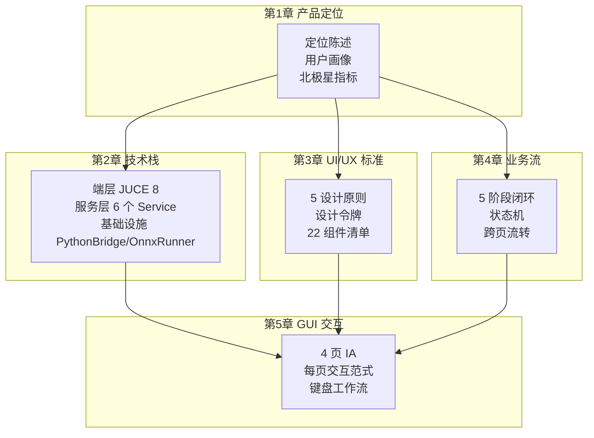
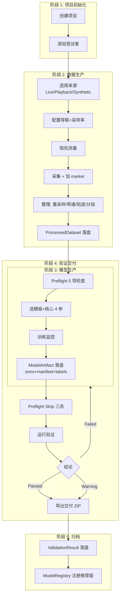
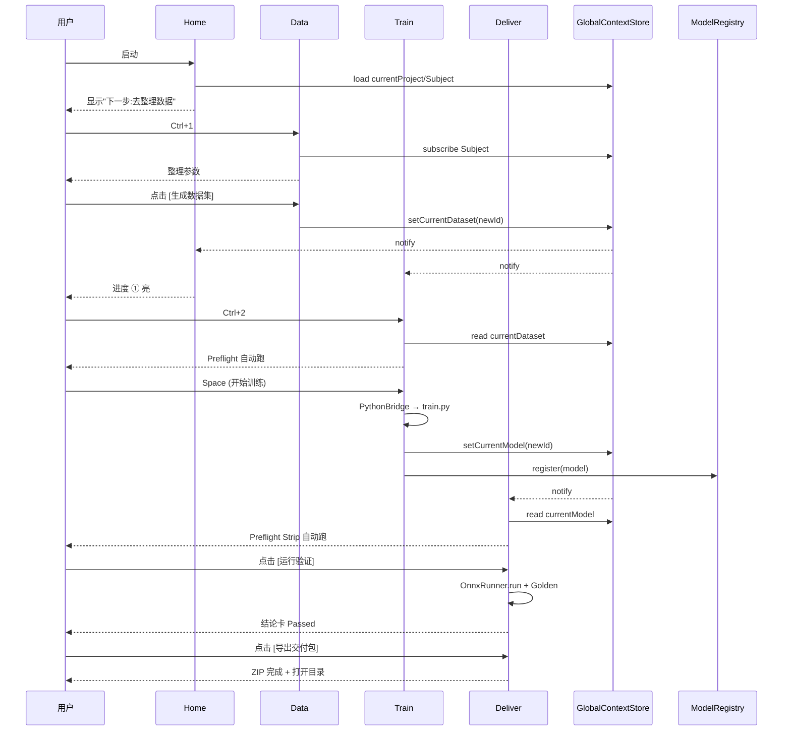
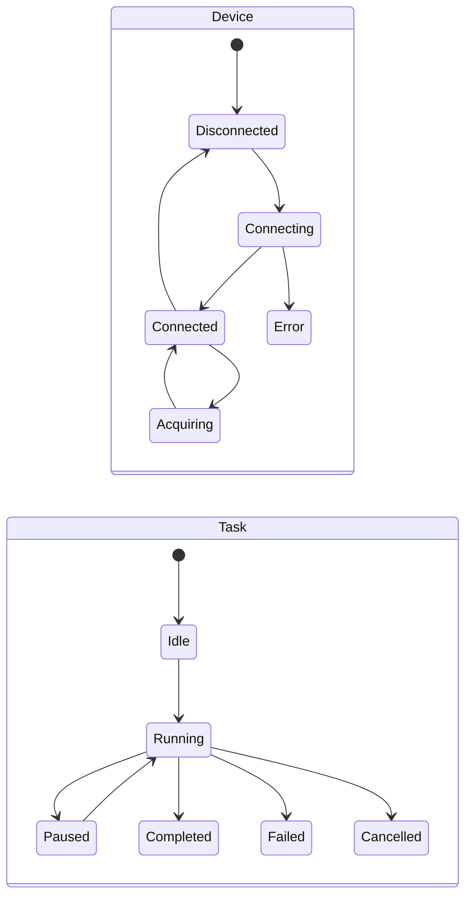
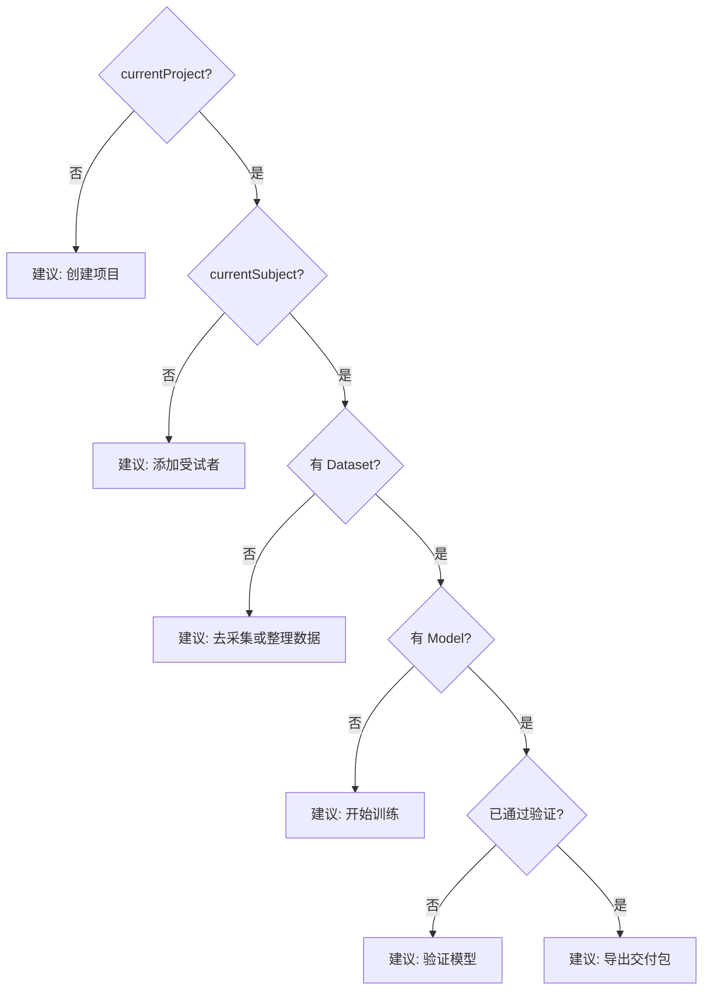
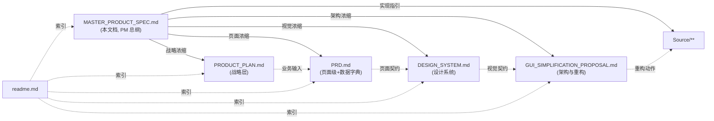

# NeuroRuntime 产品总规格（MASTER PRODUCT SPEC）

> 视角：产品经理（PM 总纲）
> 范围：产品定位 / 技术栈 / UI/UX 标准 / 业务流 / GUI 交互实现 — **5 维度统一规格**
> 编码原则：编码前思考 / 简洁优先 / 实用优先 / 精准修改 / 目标驱动执行
> 关联文档（深入阅读）：
> - 战略层：[PRODUCT_PLAN.md](PRODUCT_PLAN.md)
> - 页面级 PRD：[PRD.md](PRD.md)
> - UI/UX 系统：[DESIGN_SYSTEM.md](DESIGN_SYSTEM.md)
> - 重构动作：[GUI_SIMPLIFICATION_PROPOSAL.md](GUI_SIMPLIFICATION_PROPOSAL.md)
> - 仓库 README：[../readme.md](../readme.md)

---

## 总览



---

# 第 1 章 产品定位

## 1.1 一句话定位

> **NeuroRuntime 是一台"EEG / 神经信号 → ONNX 推理模型"的工程交付工作台**，让一个工程师在一台 Windows 笔记本上独立完成"接设备 → 整理数据 → 训练 → 验证 → 交付"的全闭环。

## 1.2 4 维定位坐标

| 维度 | 取值 | 不是 |
|------|------|------|
| **用户** | 单机工程师（采集 / 算法 / 交付）| 不是研究员 / 不是医生 / 不是终端用户 |
| **场景** | 设备厂商 / 算法外包团队的内部交付链 | 不是临床诊断 / 不是消费类 BCI |
| **价值** | 工程效率（30 分钟跑通端到端）| 不追求覆盖全部 EEG 算法 |
| **差异** | 端到端 + 中文 + 单机 | 不与 BCI2000 / OpenBCI GUI / BrainVision 重叠 |

## 1.3 北极星指标（NSM）

> **CLAUR (Closed-Loop Active User Rate)**：**一周内**完成 ≥ 1 次"数据 → ONNX → 通过验证"完整闭环的活跃用户占比。

| 阶段 | 目标 |
|------|------|
| V1 内测 | CLAUR ≥ 60% |
| V2 公开 | CLAUR ≥ 40% |

详见 [PRODUCT_PLAN.md §6](PRODUCT_PLAN.md)。

## 1.4 核心价值闭环


**关键约束**：每个箭头的意思是"上一步的产物**自动**成为下一步的输入"——不让用户自己拷文件路径。

## 1.5 反目标（不做什么）

| ID | 不做 | 理由 |
|----|------|------|
| AG-1 | 多用户协作 / 权限 / 评论 | 单机工作台定位 |
| AG-2 | 云端训练 / 远程 GPU 调度 | 不在交付链路内 |
| AG-3 | 自研设备驱动 SDK | BrainFlow 已覆盖 |
| AG-4 | 在线 ICA / ASR 高级伪迹算法 | 不做研究型算法 |
| AG-5 | 多模态融合（EEG + EMG + Eye）| 留给 V3+ |
| AG-6 | 自定义 Pipeline 节点拖拽编辑 | 已删除 PipelineCanvas |
| AG-7 | 移动端 / Web 端 | 桌面工作台优先 |

---

# 第 2 章 技术栈

## 2.1 技术决策原则

| 原则 | 含义 |
|------|------|
| **JUCE 优先** | 桌面端 GUI 用 JUCE 8.0.12（已选定），不引入 Qt / Electron |
| **Python 算法层独立进程** | 训练 / 预处理 走 Python 子进程；通过 stdout JSON 协议通信 |
| **ONNX 作为唯一推理产物** | C++ 端只做 ONNX 推理；不嵌入 PyTorch |
| **本地优先** | Python / ONNX Runtime / 模型文件全部本地，绝不依赖云 |
| **零依赖发布** | Release 目录含全部 DLL + Python 脚本，开箱即用 |
| **MSVC UTF-8 强制** | `/source-charset:utf-8` + `/execution-charset:utf-8`，杜绝中文乱码 |

## 2.2 整体架构（6 层）

```mermaid
graph TB
  subgraph UI 表现层
    Shell["AppShell<br/>NavStrip+StatusStrip+LogDrawer"]
    Pages["4 个 Page<br/>Home/Data/Train/Deliver"]
    Comp["DesignTokens<br/>MaterialCard/Chip/Snackbar"]
    Theme["ModernLookAndFeel<br/>DesignTokenStore"]
  end
  subgraph Application 应用层
    Ctx["GlobalContextStore<br/>当前 Project/Subject/Device"]
    Orch["WorkflowOrchestrator<br/>5 阶段流程守卫"]
    Pipe["PipelineStore<br/>节点状态 + 持久化"]
    Settings["RuntimeSettingsStore<br/>持久化设置"]
    Notif["NotificationCenter<br/>跨组件事件总线"]
  end
  subgraph Service 服务层
    AcqS["AcquisitionService"]
    PrepS["DatasetPreparationService"]
    TrainS["TrainingService"]
    ValS["ValidationService"]
    ModS["ModelRegistryService"]
    ExpS["RuntimeDataExportService"]
  end
  subgraph Domain 领域层
    Ent["Entities<br/>9 个 struct"]
    Ts["TaskState<br/>7 态枚举"]
    Pn["PipelineNode<br/>NodeType"]
  end
  subgraph Infra 基础设施
    PyB["PythonBridge<br/>子进程+JSON 协议"]
    Onnx["OnnxRunner<br/>ORT C++ API"]
    Board["BoardManager<br/>3 种采集模式"]
    Npz["NpzEEGLoader"]
    Log["SystemLogger<br/>分级+分类+持久化"]
    Path["ProjectPaths"]
  end
  subgraph External 外部
    Juce["JUCE 8.0.12"]
    Ort["ONNX Runtime 1.16.3<br/>DirectML/CUDA/CPU"]
    Bf["BrainFlow"]
    Py["Python 3.9-3.11<br/>PyTorch/MNE/Braindecode"]
  end
  Pages --> Ctx
  Pages --> Orch
  Pages --> AcqS
  Pages --> PrepS
  Pages --> TrainS
  Pages --> ValS
  AcqS --> Board
  PrepS --> PyB
  TrainS --> PyB
  ValS --> Onnx
  ModS --> Path
  ExpS --> Path
  AcqS --> Ent
  TrainS --> Ent
  ValS --> Ent
  Comp --> Theme
  PyB --> Py
  Onnx --> Ort
  Board --> Bf
  Shell --> Juce
```



## 2.3 端层（JUCE 8）

| 选择 | 版本 / 来源 | 决策 |
|------|------------|------|
| GUI 框架 | JUCE 8.0.12（`D:/JUCE` 本地路径，[CMakeLists.txt:12](../CMakeLists.txt#L12)）| 跨平台、纯 C++、无 Web 依赖 |
| 图形 | OpenGL 加速（`JUCE_OPENGL=1`）| 流畅波形渲染 |
| C++ 标准 | C++20 | JUCE 8 兼容性、`std::span / concepts` |
| 字符集 | UTF-8 强制（MSVC `/source-charset:utf-8`）| 杜绝中文乱码 |
| 字符串文案 | `NR_STR(L"...")` 宽字面量宏 | MSVC 中文兼容 |
| 模态 | `JUCE_MODAL_LOOPS_PERMITTED=1` | 桌面应用允许 AlertWindow 同步 |
| HTTP | `JUCE_USE_CURL=0`（Windows 用 WinInet）| 避免 libcurl 依赖 |
| Web | `JUCE_WEB_BROWSER=0` | 不需要浏览器内嵌 |
| 预编译头 | PCH（`JuceHeader.h`，可关闭）| 编译加速 40–60% |
| 资源 | `juce_add_binary_data` 嵌入 logo | 单文件部署 |

## 2.4 应用层（Application）

| 模块 | 职责 | 关键接口 |
|------|------|---------|
| `GlobalContextStore` | 全局当前对象（Project / Subject / Device / Model / Dataset / TaskProgress）| `Listener` 订阅 + 持久化 |
| `WorkflowOrchestrator` | 5 阶段流程守卫（采集/预处理/训练/验证/归档）| `checkCanNavigate(tab)` 返回 `WorkflowGuardResult` |
| `PipelineStore` | 节点状态机（持久化到 JSON）| `onNodeChanged(NodeType)` 通知 |
| `RuntimeSettingsStore` | XML 设置持久化（路径 / 主题 / EP 偏好）| 启动加载 + 即时保存 |
| `NotificationCenter` | 跨组件事件总线 | `Listener` 订阅 + Snackbar 联动 |

## 2.5 服务层（6 个 Service）

| 服务 | 职责 | 依赖 |
|------|------|------|
| `AcquisitionService` | 采集会话 + Recording 落盘 | `BoardManager` |
| `DatasetPreparationService` | 整理流水线（5 步预处理）| `PythonBridge` → `python_core/preprocess.py` |
| `TrainingService` | 训练任务管理 + 进度 | `PythonBridge` → `python_core/train.py` |
| `ValidationService` | 离线验证 + Golden Sample | `OnnxRunner` |
| `ModelRegistryService` | ONNX 模型库管理 | `ProjectPaths` |
| `RuntimeDataExportService` | 交付 ZIP 打包 | `ProjectPaths` + `ModelRegistryService` |

## 2.6 领域层（Domain）

来源：[Source/Domain/Entities.h](../Source/Domain/Entities.h)，9 个 struct：

| 实体 | 持久化位置 |
|------|----------|
| `Project` | `projects/<id>/project.json` |
| `Subject` / `SubjectRegistryEntry` | `projects/<id>/subjects.json` |
| `Session` | `projects/<id>/sessions/<id>/session.json` |
| `Recording` | `projects/<id>/recordings/<id>/recording.json` + `data.npz` |
| `ProcessedDataset` | `projects/<id>/datasets/<id>/dataset_summary.json` + `data.npz` |
| `TrainingJob` | `projects/<id>/logs/<id>/job.json` |
| `ModelArtifact` | `projects/<id>/models/<id>/manifest.json` + `model.onnx` + `labels.json` |
| `ValidationResult` | `projects/<id>/validations/<id>/validation_result.json` |
| `InferenceJob` | `projects/<id>/logs/<id>/inference.json` |

### 2.6.1 任务态（TaskState）

```
Idle / Queued / Running / Paused / Completed / Failed / Cancelled
```

来源：[Source/Domain/TaskState.h](../Source/Domain/TaskState.h)。

## 2.7 基础设施（Infrastructure）

### 2.7.1 PythonBridge（C++ ↔ Python 通信）

| 维度 | 实现 | 依据 |
|------|------|------|
| 进程模型 | `juce::ChildProcess`，独立子进程 | [PythonBridge.h:146](../Source/Core/PythonBridge.h#L146) |
| 启动命令 | `chcp 65001 && set PYTHONUTF8=1 && python -X utf8 -u <script>` | UTF-8 强制 |
| 协议 | stdout 行级 JSON：`{"type":"epoch/progress/summary/done/log/error", ...}` | [PythonBridge.h:103](../Source/Core/PythonBridge.h#L103) |
| 解码 | UTF-8 优先 → GBK / ACP fallback（Windows 中文环境）| [PythonBridge.h:21](../Source/Core/PythonBridge.h#L21) |
| 缓冲限制 | 4 MB（防止内存暴涨）| [PythonBridge.h:394](../Source/Core/PythonBridge.h#L394) |
| 中止 | `userRequestedStop` 原子标志 + `childProcess.kill()` | 优雅退出 |

### 2.7.2 OnnxRunner（推理引擎）

| 维度 | 实现 |
|------|------|
| API | `onnxruntime_cxx_api.h`（v1.16.3）|
| EP 优先级 | Auto = DirectML → CUDA → CPU 逐级 fallback |
| 编译期开关 | `NEROU_WITH_DML=1` / `NEROU_WITH_CUDA=1`（CMake 自动检测）|
| 运行期切换 | `setAccelerationMode(Auto/Cpu/DirectML/Cuda)` |
| 输入校验 | `checkInputSanity()`（±5000μV 硬上限）|
| 线程安全 | 外部 mutex 保护（`MainComponent::onnxRunnerMutex`）|

### 2.7.3 BoardManager（采集抽象）

| 维度 | 实现 |
|------|------|
| 模式 | `Synthetic` / `Playback` / `LiveBoard` 三种 |
| 单例 | `BoardManager::getInstance()` |
| 线程 | `juce::Thread`（采样泵）|
| 数据 | `EEGFrame { sequenceId, timestamp, channelData[] }` |
| 录制 | 环形缓冲 → 一次性 flush 到 NPZ |
| 实时推理接口 | `snapshotLastFramesForOnnx(numTimePoints, outCTLayout)` 返回 `(1,C,T)` 行主序 |

### 2.7.4 SystemLogger

| 维度 | 实现 |
|------|------|
| 分级 | DEBUG / INFO / WARN / ERROR |
| 分类 | 采集 / 预处理 / 训练 / 推理 / 界面 / 通知 / App / System |
| 持久化 | `<AppRoot>/logs/nerou_YYYYMMDD.log`（按天滚动）|
| 联动 | WARN/ERROR 自动冒泡为 Snackbar |
| 宏 | `NR_LOGD/I/W/E(category, msg)` |

## 2.8 外部依赖

### 2.8.1 C++ 侧

| 依赖 | 版本 | 用途 | 嵌入位置 |
|------|------|------|---------|
| JUCE | 8.0.12 | GUI 框架 | `D:/JUCE`（本地）|
| ONNX Runtime | 1.16.3 | 推理引擎 | `onnxruntime-local/`（本地解压）|
| DirectML（可选）| 与 ORT 1.16.3 配套 | Windows GPU 推理 | `onnxruntime-local/.../DirectML.dll` |
| CUDA / cuDNN（可选）| 11.8 / 8.9 | NVIDIA GPU 推理 | 系统级 + ORT CUDA EP |
| BrainFlow（V2 引入）| 5.x | 多设备采集 | （V2 阶段集成）|

### 2.8.2 Python 侧（[requirements.txt](../requirements.txt)）

| 包 | 版本 | 用途 |
|----|------|------|
| `torch` | ≥ 2.0.0 | 训练 + ONNX 导出 |
| `numpy` | ≥ 1.24.0 | 数值计算 |
| `onnx` | ≥ 1.14.0 | 模型序列化 |
| `onnxruntime` | ≥ 1.16.0 | Python 端校验 |
| `mne` | ≥ 1.4.0 | EEG 信号处理 |
| `braindecode` | ≥ 0.8.1 | 模型实现 |
| `scipy` | ≥ 1.10.0 | MNE 依赖 |
| `scikit-learn` | ≥ 1.3.0 | 数据划分 / 评估 |
| `tqdm` | ≥ 4.65.0 | 进度条（可选）|

### 2.8.3 模型库（4 个开源）

| 模型 | 用途 | 来源 |
|------|------|------|
| `EEGNet` | 通用 EEG 分类（V1 默认）| 经典 |
| `EEG-Conformer` | 高精度 ERP 分类 | 2022 |
| `LaBraM` | 大模型预训练 + 微调 | 2024 |
| `BIOT` | 多模态 EEG 表征 | 2023 |

## 2.9 构建与部署

### 2.9.1 工具链

| 工具 | 路径 / 版本 |
|------|----------|
| MSVC | Visual Studio 2026（`D:\AppData\vsc2026`，README 第 188 行）|
| Cygwin | `D:\AppData\cygwin64`（提供 Unix 工具）|
| vcpkg | `D:\AppData\vcpkg`（备用包管理）|
| CMake | ≥ 3.20 |
| 一键构建 | `build_auto_ci.cmd` |
| Native 构建 | `build_native.bat` |

### 2.9.2 构建产物

```
build/NerouRuntime_artefacts/Release/
├── NerouRuntime.exe
├── onnxruntime.dll
├── onnxruntime_providers_shared.dll
├── DirectML.dll                  (可选)
├── onnxruntime_providers_cuda.dll (可选)
├── data/                          (training_files / raw_files / npz / samples / cache)
├── onnx/                          (models / deploy / runtime_data / templates)
├── reports/                       (training / validation)
├── logs/                          (training / inference / runtime_data)
├── projects/default_project/      (training_files / datasets / models / ...)
├── python_core/                   (preprocess.py / train.py / env_probe.py)
├── resource_layout.json
└── init_workspace.bat
```

详见 [CMakeLists.txt:344-392](../CMakeLists.txt#L344)。

### 2.9.3 一键启用 DirectML

```powershell
.\tools\fetch_onnxruntime_directml.ps1
Remove-Item -Recurse -Force build; cmake -B build
cmake --build build --config Release
```

### 2.9.4 部署形态

| 维度 | 取值 |
|------|------|
| 平台 | **Windows 10/11 优先**；Linux/macOS 顺带（不主动测试）|
| 形态 | **绿色版 ZIP**（解压即用）|
| Python | 用户自带 / 内置 portable Python（V2 规划）|
| 安装 | 不需要管理员权限 |
| 卸载 | 删除目录即可 |

## 2.10 关键架构决策记录（ADR）

| 决策 | 取舍 | 理由 |
|------|------|------|
| **GUI = JUCE，不是 Qt / Electron** | 选 JUCE | 单一二进制、无运行时依赖、波形渲染性能好 |
| **算法 = Python 子进程，不是嵌入式 Python** | 选子进程 | 进程隔离、崩溃不连累 GUI、用户可换解释器 |
| **推理 = ONNX，不是 LibTorch** | 选 ONNX | 客户端通用性（DirectML 集显都能跑）、可量化 |
| **设备 = BrainFlow（V2），不是自写驱动** | 选 BrainFlow | 已支持 30+ 设备、维护活跃 |
| **数据落盘 = NPZ + JSON manifest，不是 HDF5** | 选 NPZ | numpy 原生、Python 互通、不引入 HDF5 依赖 |
| **状态共享 = Singleton + Listener，不是 Redux 风格** | 选 Listener | C++ 自然、JUCE 习惯 |
| **持久化 = JSON / XML，不是 SQLite** | 选文件 | 无 schema 锁定、可手动编辑、单机够用 |
| **Build = CMake + JUCE add_subdirectory** | 选 CMake | 跨编辑器、与 JUCE Projucer 兼容 |

---

# 第 3 章 UI/UX 标准

> 本章是 [DESIGN_SYSTEM.md](DESIGN_SYSTEM.md) 的浓缩版。完整规范见独立文档。

## 3.1 5 设计原则

| 原则 | 含义 |
|------|------|
| **P1 工作流显形** | 让用户随时知道"我在哪 / 做完了什么 / 接下来该做什么" |
| **P2 高可信** | 浅色为主、最多 2 强调色；状态色文字双通道 |
| **P3 渐进披露** | 默认显示核心字段，"高级"折叠区放专家选项 |
| **P4 可追溯** | 每个产物溯源到上游；路径可一键复制 |
| **P5 长会话友好** | 不闪烁、不循环呼吸；浅色 + 暗色双模式 |

## 3.2 设计令牌（与 [DesignTokens.h](../Source/UI/Theme/DesignTokens.h) 对齐）

### 3.2.1 颜色

V1 默认主题：**MedicalBlue（浅色）**。

| 角色 | 令牌（语义角色，不直接写 #HEX）|
|------|------------------------------|
| 主色 | `primary` / `onPrimary` / `primaryContainer` / `onPrimaryContainer` |
| 次色 | `secondary` / `onSecondary` / `secondaryContainer` / `onSecondaryContainer` |
| 错误 | `error` / `onError` / `errorContainer` / `onErrorContainer` |
| 表面 | `surface` / `onSurface` / `surfaceVariant` / `onSurfaceVariant` |
| 表面层级 | `surfaceContainer` / `surfaceContainerHigh` / `surfaceContainerHighest` / `surfaceContainerLow` / `surfaceContainerLowest` |
| 背景 | `background` / `onBackground` / `outline` / `outlineVariant` |
| 状态 | `statusSuccess` / `statusWarning` / `statusError` / `statusInfo` / `statusRunning` / `statusIdle` |
| 波形 | `waveformBackground` / `waveformGrid` / `waveformChannelColors[0..7]` |

**强制**：所有页面只能引用语义令牌，禁止直接 `#HEX` 或 `C_PRIMARY` 等硬编码。

### 3.2.2 字体（CJK 优先栈，已实现于 `resolveUiFont()`）

```
Microsoft YaHei UI → Microsoft YaHei → PingFang SC → Hiragino Sans GB
→ Noto Sans CJK SC → WenQuanYi Micro Hei → SimHei
```

排版 5 级：`displayXxx` / `headlineXxx` / `titleXxx` / `bodyXxx` / `labelXxx`，外加 mono 3 级（`monoLarge` / `monoMedium` / `monoSmall`）。

**强制**：路径 / 错误码 / 时间戳 / 数字必须 mono 字体。

### 3.2.3 间距（仅用 7 档 → 实际 6 档）

| 令牌 | 像素 | 用途 |
|------|-----:|------|
| `dp1` | 4 | 微调 |
| `dp2` | 8 | 紧凑 padding |
| `dp3` | 12 | 卡片内 padding |
| `dp4` | 16 | 区块间距 |
| `dp6` | 24 | 大区块间距 |
| `dp8` | 32 | 页面边距 |
| `dp12` | 48 | 大留白（少用）|

### 3.2.4 圆角（3 档）

```
Chip/Input 4px  →  Button 8px  →  Card 8px  →  Dialog 12px
```

### 3.2.5 阴影（4 档：0/1/2/3）

```
0 平铺  →  1 hover/卡片  →  2 浮动菜单  →  3 对话框
```

### 3.2.6 动画（与令牌一致）

| 用途 | 时长 | 缓动 |
|------|-----:|------|
| 微交互 | 150 ms | standard |
| 切换/抽屉 | 250–300 ms | decelerate |
| Snackbar | 400 ms | decelerate |
| Dialog | 350 ms | decelerate |

## 3.3 22 组件清单（索引）

| # | 组件 | 实现位置 |
|---|------|---------|
| 01 | Button (Filled/Outlined/Text/Danger) | `juce::TextButton + ModernLookAndFeel` |
| 02 | IconButton | 同上 |
| 03 | Card | `Components/MaterialCard.h` |
| 04 | Chip / StatusChip | `Components/MaterialChip.h` |
| 05 | Badge | NavStrip 内挂 |
| 06 | Divider | `outlineVariant` 线 |
| 07 | Input (TextEditor) | JUCE 原生 |
| 08 | Select (ComboBox) | JUCE 原生 |
| 09 | Slider | JUCE 原生 |
| 10 | Toggle / Switch | JUCE 原生 |
| 11 | Checkbox / Radio | JUCE 原生 |
| 12 | ProgressBar | JUCE 原生 |
| 13 | Spinner | JUCE 原生 |
| 14 | Snackbar | `Components/MaterialSnackbar.h` |
| 15 | Dialog | JUCE AlertWindow 包装 |
| 16 | Drawer | `Shell/AppShell.h::LogDrawer` |
| 17 | Tooltip | JUCE TooltipWindow |
| 18 | NavRail (NavStrip) | `Shell/AppShell.h::NavStrip` |
| 19 | Tab | （仅页面内子分组）|
| 20 | Stepper (WorkflowStepperBar) | 仅 Home 页一处 |
| 21 | Breadcrumb | StatusStrip 左侧 |
| 22 | DataCard / MetricStrip / WaveformView / ChartContainer | `RealtimeMetricsCanvas / WaveformCanvas` |

## 3.4 6 态状态规范

每个长任务**必须**实现：

```
Empty → Ready → Running → Success/Warning/Failure
                  ↓
                Stale（结果过期）
```

颜色映射 statusXxx 令牌 + **必须配文字**（避免色盲歧义）。

## 3.5 8 个快捷键

| 快捷键 | 动作 |
|-------|------|
| `Ctrl+0/1/2/3` | 切 Home/Data/Train/Deliver |
| `Ctrl+K` | 命令面板 |
| `Ctrl+L` | 日志抽屉 |
| `Ctrl+,` | 设置 |
| `Ctrl+M` | 数据页加 marker |
| `Space` | 训练页开始/暂停 |

## 3.6 错误诊断 4 段式

```
[图标] 标题 (≤12字)
       错误码 (XXX-NNN)

原因: ≤60字

建议:
• 动作 1
• 动作 2

[复制错误码] [打开日志] [重试/修复]
```

## 3.7 黑名单（不做的视觉）

- ❌ 装饰性闪烁 / 呼吸效果 / 自动旋转
- ❌ 单页 ≥ 2 个 Filled 按钮
- ❌ 同一概念 ≥ 2 处 UI 表达
- ❌ 三栏布局（已退役）
- ❌ FAB（桌面端不需要）
- ❌ Emoji（除非用户要求）
- ❌ 纯黑 `#000000` 背景 / 纯白 `#FFFFFF` 文字
- ❌ 占位 placeholder 替代 label

---

# 第 4 章 业务流

## 4.1 闭环全景图



## 4.2 5 阶段进入/退出条件

| 阶段 | 进入条件 | 退出条件 |
|------|---------|---------|
| 项目初始化 | 软件首次启动 / 用户主动新建 | `Project + Subject` 至少各 1 |
| 数据生产 | 已选 Project + Subject | 至少有 1 个可用 ProcessedDataset |
| 模型生产 | 至少有 1 个可用 Dataset | 至少有 1 个 ModelArtifact + Preflight 5/5 通过 |
| 验证交付 | 至少有 1 个 ModelArtifact | ValidationResult.passed = true |
| 归档 | ValidationResult.passed = true | ModelRegistry 注册 + 交付 ZIP 存在 |

## 4.3 跨页状态流转



## 4.4 关键路径（Happy Path）

> 北极星动作：**新用户 30 分钟跑通端到端**。

| 步骤 | 操作 | 预期耗时 | 关键检查点 |
|------|------|---------:|-----------|
| 1 | 启动软件 | 5 s | Home 显示欢迎卡 |
| 2 | 创建项目 | 30 s | 项目目录已建 |
| 3 | 添加受试者 | 30 s | subjects.json +1 |
| 4 | 选 Synthetic 数据源 + 16ch/500Hz | 15 s | 波形 3 秒内出现 |
| 5 | 录制 60 秒 | 60 s | NPZ 已保存 |
| 6 | 整理（默认参数）| 10–60 s | dataset_summary.json 已建 |
| 7 | 切到训练页 | 1 s | Preflight 自动 5/5 |
| 8 | 选 EEGNet + 100 epochs + 默认参数 | 10 s | 配置完成 |
| 9 | 开始训练 | 10–20 分钟 | 双曲线动 |
| 10 | 切到交付页（自动 toast）| 1 s | Preflight 自动 3/3 |
| 11 | 运行验证 | 30 s | 结论卡 Passed |
| 12 | 导出交付包 | 5 s | ZIP 含 9 个文件 |

**目标总耗时**：≤ 30 分钟（其中 9 个步骤是 GUI 操作，约 5 分钟；训练占 ≈ 25 分钟）。

## 4.5 异常分支（Top 5 失败路径）

| ID | 路径 | 触发条件 | 用户感知 | 恢复 |
|----|------|---------|---------|------|
| E1 | 设备掉线 | USB 拔出 / 蓝牙断开 | 红 Snackbar + 状态栏变红 | 重连 / 切 Synthetic |
| E2 | NPZ 形状混合 | 整理目录含多种 C×T | Preflight PF4 红 | 重新整理或筛选文件 |
| E3 | 训练 OOM | GPU 显存不足 | 训练失败 + TRAIN-003 | 降 batch_size / 切 CPU |
| E4 | Golden 不通过 | ONNX 推理与 PyTorch 差异 > 1e-3 | Deliver 结论 Warning | 强制导出 / 重训 |
| E5 | Python 环境缺包 | torch / mne 未安装 | 启动 PythonBridge 失败 | 提示 `pip install -r requirements.txt` |

## 4.6 状态总览（设备 + 任务）



详见 [PRD.md §2](PRD.md)。

---

# 第 5 章 GUI 交互实现

## 5.1 4 页 IA 与全局壳层

```
┌────────────────────────────────────────────────────────────────┐
│  StatusStrip (28px)                                            │
│  项目: ProjectA ▾ │ 受试者: S001 ▾  │  主操作 │ 次操作         │
├──────┬─────────────────────────────────────────────────────────┤
│ Nav  │                                                         │
│ 96px │           Page Content (4 选 1)                         │
│      │                                                         │
│  H   │  ┌─ Home ───────────────────────────────────────────┐  │
│  D   │  │  [下一步建议]                                    │  │
│  T   │  │  4 步进度  │  最近产物                            │  │
│  V   │  └──────────────────────────────────────────────────┘  │
│      │                                                         │
│ ⚙Set │                                                         │
├──────┴─────────────────────────────────────────────────────────┤
│  LogDrawer (28 折叠 / 200 展开, Ctrl+L)                        │
└────────────────────────────────────────────────────────────────┘
```

| 区域 | 尺寸 | 实现 |
|------|------|------|
| StatusStrip | 28 px 高 | `AppShell.h::StatusStrip` |
| NavStrip | 96 px 宽，5 项（4 页 + 设置）| `AppShell.h::NavStrip` |
| Page Content | 弹性 | `AppShell.h::PageTransition` 包装 |
| LogDrawer | 28 折叠 / 200 展开 | `AppShell.h::LogDrawer` |

## 5.2 工作台 Home 交互范式

### 5.2.1 线框图

```
┌────────────────────────────────────────────────────────────┐
│   ▶  数据集还差 12 个 NPZ，去整理 →                         │ ← 主操作大按钮
├──────────────────────────────────────────┬─────────────────┤
│ 进度（4 步 Stepper）                     │ 最近产物         │
│                                          │                 │
│ ① 数据  ●●○○                             │ • dataset_xxx   │
│ ② 训练  ○○                               │ • model_v3.onnx │
│ ③ 验证  ○                                │ • report_v3.pdf │
│ ④ 交付  ○                                │ ...             │
└──────────────────────────────────────────┴─────────────────┘
```

### 5.2.2 交互模式

| 元素 | 交互 |
|------|------|
| 主操作大按钮 | 单击 = 跳转下一阶段；Tab 可达；Enter 触发 |
| 进度 Stepper | 只读；点击某步骤 = 切到对应 Tab |
| 最近产物 | 单击 = 打开所在目录；右键 = 复制路径 |
| 项目下拉 | 单击 PopupMenu，列出所有项目 + "创建项目" |
| 受试者下拉 | 同上，仅当前项目下的 Subject |

### 5.2.3 决策树（"下一步"自动推导）



## 5.3 数据 Data 交互范式

### 5.3.1 线框图

```
┌─────── 来源（左 320px）──────┬──── 信号视图 / 数据集摘要 ─────┐
│ [真机 | 回放 | 合成]          │                                │
│ 设备状态: ●已连 16ch 500Hz    │   实时波形（Live 模式）         │
│ ─────────                    │     OR                         │
│ 受试者: S001 [选择…]          │   已生成数据集列表             │
│ ─────────                    │                                │
│ [采集参数]  [显示参数]        │                                │
│ ─────────                    │                                │
│ [整理参数]                   │   底部: 阻抗条 / 信号质量条     │
│   ☑ 重采样 250Hz             │                                │
│   ☑ 带通 1-45 Hz             │                                │
│   ☑ 50Hz 陷波                │                                │
│   分段 4s / 重叠 50%         │                                │
│   ▾ 高级（伪迹/参考/增强）   │                                │
│                              │                                │
│ [▶ 开始采集] / [▶ 生成数据集]│                                │
└──────────────────────────────┴────────────────────────────────┘
```

### 5.3.2 交互模式

| 元素 | 交互 |
|------|------|
| **来源切换** | 单选 RadioGroup；切换重置主区域，**保留**整理参数 |
| **加 marker** | `Ctrl+M`（不需鼠标）；marker 即时显示在波形上 |
| **快捷事件** | 删除（旧设计的 4 个按钮 + 预设下拉）；统一用 Ctrl+M |
| **沉浸/Zen 模式** | 删除（用 F11 全屏即可）|
| **通道列表** | 折进波形右上角弹层（不占左/右栏）|
| **阻抗** | 自动测量 → 颜色 4 级染色 + 文字 |
| **整理参数实时校验** | low ≥ high → 实时禁用 [生成数据集] |
| **预览对比** | 删除（工作台不做研究型对比）|

### 5.3.3 来源切换矩阵

| 来源 | 主区域显示 | 必填字段 | 主操作 |
|------|----------|---------|--------|
| Live | 实时波形 + 阻抗 | 设备 / 通道 / 采样率 / 受试者 | [开始采集] |
| Playback | 文件列表 + 选中预览 | NPZ 文件路径 | [生成数据集] |
| Synthetic | 实时波形（模拟）| 通道 / 采样率 / 受试者 | [开始采集] |

## 5.4 训练 Train 交互范式

### 5.4.1 线框图

```
┌──── 配置（280px）────┬──────── 监控 ────────┐
│ 数据集: ds_2026 ▾    │  Loss   ↘ ────────  │
│ 模型: EEGNet ▾       │  Acc    ↗ ────────  │
│ Epochs: [100]        │                      │
│ Batch:  [32 ▾]       │  loss=0.245 acc=0.91 │
│ LR:     [1e-3 ▾]     │  Epoch 32/100 ████   │
│ 输出:  [model_v4]    │  ETA 14:23           │
│ ─────────            │                      │
│ 预检：✅ 5/5 通过 ↻  │  [▶ 开始]  [⏸] [⏹]  │
│ ▾ 高级（微调/冻结层）│                      │
└──────────────────────┴──────────────────────┘
```

### 5.4.2 交互模式

| 元素 | 交互 |
|------|------|
| **数据集选择** | ComboBox 列出当前项目的 Dataset；自动选最近一个 |
| **Preflight** | 选数据集后**自动**跑；点 ↻ 重跑 |
| **Preflight 不通过** | 主按钮 [▶ 开始] 禁用 + Tooltip 显示原因 |
| **学习率滑块** | 对数刻度，10 档：1e-5 / 5e-5 / 1e-4 / 5e-4 / 1e-3 / 5e-3 / 1e-2 / 5e-2 / 1e-1 |
| **开始训练** | 主按钮 / `Space`；进度卡每 epoch 更新 |
| **暂停** | `Space` 切换；写 `.nerou_train_pause` 文件给 Python 端读 |
| **停止** | `Stop` 按钮 → 二次确认 → kill child process |
| **完成** | Snackbar Success "模型已就绪 → 去验证"；Home 进度 ② 亮 |
| **失败** | 红色对话框 + 4 段式错误信息 + 复制错误码 |
| **数据卡** | 4 个数字（loss / acc / epoch / ETA），mono 字体；不做卡片装饰 |
| **图表** | 双曲线（train / val），鼠标 hover 显示具体数值 |

### 5.4.3 训练前 Preflight 5 项

| 编号 | 检查 | 失败码 | 主区域 |
|------|------|-------|--------|
| PF1 | 数据目录存在 | BadDir | "数据目录不存在或无访问权限" |
| PF2 | 目录内有 NPZ | NoNpz | "目录内未找到 *.npz 文件" |
| PF3 | NPZ 可读 | NpzReadErr | 显示首个错误文件 |
| PF4 | 形状一致（C×T 占多数）| ManifestMismatch | "目录混合多种形状，建议先整理" |
| PF5 | manifest.json 形状对齐 | ManifestMismatch | "manifest C×T 与数据不一致" |

## 5.5 交付 Deliver 交互范式

### 5.5.1 线框图

```
┌──────────────────────────────────────────────────────────────┐
│        ✅ 验证通过                                            │  ← 顶部结论卡
│        准确率 91.3%  F1 0.89  延迟 3.2 ms                     │
│        [导出交付包]   [查看详情]                              │
├──────────────────────────────────────────────────────────────┤
│ Preflight Strip                                               │
│ 模型 ●  测试数据 ●  对齐 ●     [运行验证]                     │
├────────────────────┬─────────────────────────────────────────┤
│ 输入配置(左 280)   │  性能指标 + Golden + 漂移               │
│  • 模型路径        │  • acc / precision / recall / F1        │
│  • 测试数据        │  • 混淆矩阵                             │
│  • Golden Sample   │  • 类别性能表                           │
│                    │  • Golden 通过率                        │
│                    │  • 数值漂移检测                         │
└────────────────────┴─────────────────────────────────────────┘
[▾ 详细诊断 (折叠)]
```

### 5.5.2 交互模式

| 元素 | 交互 |
|------|------|
| **结论卡** | 4 态颜色（NotStarted/Passed/Warning/Failed）；主按钮随结论变 |
| **Preflight Strip** | 三状态点 + 一键修复（如形状不匹配 → 跳整理页）|
| **运行验证** | 进度条 + 实时指标更新 |
| **导出 ZIP** | 主按钮（仅 Passed/Warning 时启用）|
| **导出后** | Snackbar Success + 一键打开目录 |
| **诊断面板** | 默认折叠；展开后显示形状 / 数值范围 / ONNX 结构详情 |
| **改进建议** | 失败时自动生成（基于错误码）|
| **Baseline 对比** | （V3）选另一个 Model → 显示 acc 差 |

### 5.5.3 导出 ZIP 结构

```
{modelName}_v{x}_delivery.zip
├── model.onnx
├── manifest.json              # 含 inputC / inputT / outputClasses
├── labels.json                # 类别中英文名
├── golden_sample.npz          # 含 framework + onnx 推理结果对比
├── dataset_summary.json       # 训练数据集元信息
├── validation_result.json     # 本次验证结论 + 指标
├── report.pdf                 # 一页结论报告（V3 实现）
├── version_info.txt           # NeuroRuntime 版本 + 训练时间 + 主机指纹
└── README.txt                 # 客户端加载说明
```

## 5.6 跨页交互模式

### 5.6.1 项目切换（StatusStrip 面包屑）

```
点击 [项目: ProjectA ▾]
  → PopupMenu 弹出:
       • ProjectA  ✓
       • ProjectB
       • ProjectC
       ─────────
       • [创建新项目…]
       • [打开项目目录]
  → 选 ProjectB
  → GlobalContextStore.setCurrentProject(B)
  → 所有页面 onProjectChanged 回调
  → 整页内容 ≤ 200ms 刷新
```

### 5.6.2 任务回填（自动跳页 + 选中产物）

| 触发 | 跳转 | 自动选中 |
|------|------|---------|
| Data 整理完成 | Train（如用户已在 Train 页则不跳）| Dataset 自动选最近 |
| Train 完成 | 显示 Snackbar "模型已就绪 → 去验证"，**不强制跳** | Model 自动注册 |
| Deliver Preflight 失败 | 一键修复 → 跳到对应阶段（如 Data 重整理）| 已有数据 |

### 5.6.3 路径复制约定

每处显示路径的地方都满足：

- 文字 mono 字体
- 鼠标 hover 显示完整路径 Tooltip
- 右键菜单 = "复制路径 / 打开所在目录"
- `Ctrl+C` = 当前焦点路径

### 5.6.4 错误冒泡链

```
Service 层抛异常
  → SystemLogger.logE(category, msg)
     → onLogReceived 回调触发 Snackbar(Error)
        → 用户点击"打开日志"
           → LogDrawer 自动展开 + 过滤分类 + 滚动到时间点
              → 4 段式错误对话框（如启用）
```

## 5.7 命令面板（Ctrl+K）使用模式

```
┌─────────────────────────────────────┐
│ 🔍 搜索命令、跳转、设置...        Esc│
├─────────────────────────────────────┤
│ 导航                                │
│   打开数据                  Ctrl+1  │
│   打开训练                  Ctrl+2  │
│ 任务                                │
│   开始训练                  Space   │
│   导出交付包                        │
│ 项目                                │
│   切换项目                          │
│   创建受试者                        │
│ 系统                                │
│   设置                      Ctrl+,  │
│   系统日志                  Ctrl+L  │
└─────────────────────────────────────┘
```

| 维度 | 规范 |
|------|------|
| 触发 | `Ctrl+K` |
| 模糊匹配 | label + 中英别名 |
| 命令数 | ≤ 20 条（避免堆砌）|
| 键盘 | ↑↓ 切换、Enter 执行、Esc 关闭 |

## 5.8 长任务进度反馈规范

| 时长 | UI 表现 |
|------|---------|
| < 200 ms | 不反馈（避免闪烁）|
| 200 ms – 2 s | Spinner 16 px |
| 2 s – 10 s | Spinner + "正在加载…" |
| 10 s – 5 min | 进度条 + ETA（每秒更新）|
| > 5 min | 进度条 + ETA + 阶段说明 + [取消] |

> 训练任务（10–20 分钟）必须满足"> 5 min"档：进度条永远在场、ETA 有效、可暂停/停止。

## 5.9 键盘优先工作流（专家模式）

完整流程**全程键盘可达**：

```
Ctrl+0  打开 Home
Tab     聚焦 [创建项目]
Enter   弹对话框
… 输入项目名 …
Enter   确认
Ctrl+1  跳数据
Tab     聚焦"来源"
↓       选 Synthetic
Tab     ……
Enter   开始采集
Ctrl+M  加 marker
…
Ctrl+2  跳训练
Tab     ……
Space   开始训练
…
Ctrl+3  跳交付
Enter   运行验证
Tab     聚焦 [导出交付包]
Enter   导出
```

## 5.10 性能预算

| 维度 | 目标 | 测量 |
|------|------|------|
| 启动时间 | ≤ 3 秒（冷启动）| 从 EXE 双击到 Home 渲染 |
| 页面切换 | ≤ 200 ms | switchTab 到完全渲染 |
| 波形渲染 | 60 FPS（OpenGL）| WaveformCanvas |
| 训练 UI 刷新 | ≥ 1 Hz | 4 数字 + 进度条 |
| 实时推理 | ≥ 5 Hz | OnnxRunner.runInference |
| 项目切换 | ≤ 200 ms | onProjectChanged 全链路 |
| 内存占用 | ≤ 500 MB（空闲）| 任务管理器 |
| 崩溃率 | ≤ 0.1%（每周）| SystemLogger 上报 |

---

# 附录 A：与现有文档的关系



| 看哪份 | 何时 |
|------|------|
| **MASTER_PRODUCT_SPEC.md（本文档）** | 第一次了解产品全貌；新成员入职；评审 / 决策 |
| PRODUCT_PLAN.md | 写 OKR / 路线图 / 用户故事 / 竞品分析 |
| PRD.md | 实现具体页面；查字段 / 验收用例 / 错误码 |
| DESIGN_SYSTEM.md | 写组件 / 页面布局 / 视觉评审 |
| GUI_SIMPLIFICATION_PROPOSAL.md | 重构现有代码；删冗余 |

---

# 附录 B：术语表

| 术语 | 含义 |
|------|------|
| **NSM** | North Star Metric，北极星指标（CLAUR）|
| **CLAUR** | Closed-Loop Active User Rate，闭环活跃用户占比 |
| **TTFM** | Time To First Model，首次产出模型耗时 |
| **PFR** | Preflight Pass Rate，训练前检查通过率 |
| **EP** | Execution Provider（ONNX Runtime 执行提供者）|
| **NPZ** | NumPy 压缩多数组容器（`*.npz`）|
| **Golden Sample** | 黄金样本，PyTorch 训练时记录的输入+输出对，用于 ONNX 一致性回归 |
| **Manifest** | 模型元数据 JSON（input C/T、采样率、类别）|
| **Preflight** | 训练前 5 项数据检查 |
| **Aha 时刻** | 用户首次感受到产品价值的瞬间（30 分钟跑通端到端）|

---

> 本文档为 PM 总纲，统合 5 维度。**不修改任何源代码**。
> 实现细节分别见各专项文档；本文档作为入口与对齐基线。
