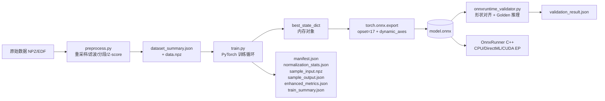
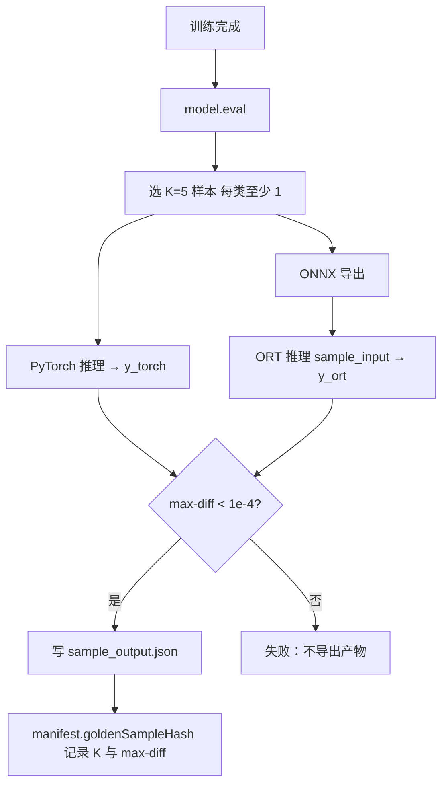

# 模型训练工程化（MODEL_TRAINING_ENGINEERING）

> 视角：**ONNX Runtime 工程师** — 关心的是「训练得到的权重如何在客户端被 ORT 正确、稳定、低延迟地推理」。
> 配套文档：
> - 用户故事与 UX 字段：[PRD.md](PRD.md) §3.3
> - 产品定位与路线图：[PRODUCT_PLAN.md](PRODUCT_PLAN.md)
> - 硬件加速与 EP 选择：[HARDWARE_ACCELERATION.md](HARDWARE_ACCELERATION.md)
> 对齐代码：
> - 训练脚本：[`python_core/train.py`](../python_core/train.py)
> - 模型工厂：[`python_core/model_presets.py`](../python_core/model_presets.py)
> - 通用导出器：[`python_core/export/onnx_exporter.py`](../python_core/export/onnx_exporter.py)
> - 推理校验器：[`python_core/validation/onnxruntime_validator.py`](../python_core/validation/onnxruntime_validator.py)
> - C++ 推理入口：[`Source/Inference/OnnxRunner.cpp`](../Source/Inference/OnnxRunner.cpp)

---

## 0. 文档边界

本文档**只回答工程问题**，不讨论：算法学术贡献、模型创新、研究型 EEG 流水线。它的全部目标只有一个——

> 让一份在 NeuroRuntime 训练出来的 `.onnx`，能被 ORT 在 CPU / DirectML / CUDA 三种 EP 上以**与 PyTorch 数值一致**的方式正确推理，并保证产物可被客户端零配置加载。

**读者**：训练脚本维护者、ONNX 导出维护者、推理引擎维护者、交付工程师。
**不读者**：纯算法工程师（请看 PRD.md §3.3 即可）、UI 工程师。

---

## 1. 全链路工程视图



链路里 ORT 工程师的**4 个交接点**：

| 交接点 | 上游产物 | 下游契约 | 失败的工程后果 |
|--------|---------|---------|---------------|
| T1 训练 → 导出 | `model.eval() + best_state_dict` | `torch.onnx.export` 入参 | 导出图含训练态算子（Dropout 未折叠 / BN 未冻结）→ 推理结果偏移 |
| T2 导出 → 产物 | ONNX 图 | `manifest.json` + `normalization_stats.json` | 客户端不知通道数/采样率/归一化参数 → 加载即崩或精度雪崩 |
| T3 产物 → 验证 | ONNX + Golden Sample | ORT 推理结果 vs `sample_output.json` | 漂移未被发现 → 上线后才暴露 |
| T4 验证 → 部署 | 通过验证的产物 ZIP | `OnnxRunner` 在多 EP 加载 | EP 不支持的算子在客户端报错 |

> 本文档第 2–6 章逐一拆解 T1–T4。

---

## 2. 训练阶段参数细化（与 ONNX 的关联）

> 凡是会影响**最终图结构、权重数值、输入形状**的训练参数，都列入本表。
> 与 PRD §3.3.2 的"核心 6 字段 + 高级 4 字段"是**多对一**关系：PRD 是 UX 显示，本表是工程默认。

### 2.1 数据契约（不可妥协）

| 项 | 取值 | 默认 | 与 ONNX 关联 |
|----|------|------|-------------|
| 张量布局 | `(N, C, T)` | NCT | ONNX `inputShape = [batch, C, T]`；与 `OnnxRunner` `inputFormat=NCT` 强对齐，禁止改 NTC |
| dtype | `float32` | `float32` | ORT FP32 默认 EP 全支持；FP16 见 §6 |
| 标签 dtype | `int64` | `int64` | 不进入 ONNX；仅训练用 |
| C 取值 | 8 / 16 / 32 / 64（user_rule §1）| 跟随数据 | 写入 `manifest.channelCount`，推理端必须按此切片 |
| T 取值 | 通常 `sr × window_sec` | `250×4=1000` | 写入 `manifest.windowSizeSamples`；超过 4096 时建议做窗口压缩 |
| 归一化 | per-channel z-score | 开启 | **必须**导出 `normalization_stats.json`，客户端预处理用 |

参考实现：`python_core/preprocess.py:196`（`normalize_per_channel`）+ `python_core/train.py:273`（`_write_normalization_stats`）。

### 2.2 优化超参（写入 `train_summary.json`）

| 字段 | 类型 | 推荐范围 | 默认 | 影响 | 与 ONNX 关联 |
|------|------|---------|------|------|-------------|
| `epochs` | int | 30 – 300 | 30（CLI）/ 100（PRD UX）| 收敛与过拟合权衡 | 间接（影响权重） |
| `batch` | int | 16 / 32 / 64 / 128 | 64 | 显存占用 + 梯度方差 | **batch=1 训练**会得到不稳定 BN 统计量，导致导出后 BN 均值方差差异大；强烈不建议 < 8 |
| `lr` | float | 1e-5 – 1e-2（log scale）| 5e-4 | 收敛速度 | 间接 |
| `val_split` | float | 0.1 – 0.3 | 0.2 | early stop 依据 | 间接 |
| `optimizer` | enum | AdamW / SGD | AdamW（`model_presets.py:335`）| 收敛形态 | 间接 |
| `weight_decay` | float | 1e-5 – 1e-3 | 1e-4 | L2 正则 | 间接 |
| `scheduler` | enum | ReduceLROnPlateau / Cosine | Plateau（有 val_loader 时）| 平台期降学习率 | 间接 |
| `scheduler.patience` | int | 5 – 15 | 10 | 等多少轮不下降才衰减 | 间接 |
| `scheduler.factor` | float | 0.3 – 0.7 | 0.5 | 衰减比例 | 间接 |

> **工程提醒**：`batch_size` 在导出时不影响 ONNX 图（因 `dynamic_axes` 已声明 batch 动态），但客户端推理 batch=1 时若训练用过 GroupNorm/SyncBN，会出现数值偏差——当前栈未启用故无影响。

### 2.3 损失函数与正则化

| 项 | 当前实现 | 默认 | ONNX 影响 |
|----|---------|------|----------|
| 损失类型 | `FocalLoss(α=0.6, γ=2.0)` 或 `CrossEntropyLoss` | Focal | **不进入 ONNX 图**（仅训练侧）。导出图最终算子为 `Softmax` 或裸 `Logits` |
| 标签平滑 | 0.05 / 0.1 | 0.05 | 不进入 ONNX |
| Dropout（训练期）| 0.25 / 0.5 | 跟模型 | **eval 模式下被折叠为 Identity** — 这是导出 SOP 的关键，详见 §3.4 |
| BatchNorm | 训练期统计；eval 期使用 running mean/var | 跟模型 | **导出前必须 `model.eval()`**，否则 ONNX 图会带 `BatchNormalization` 算子的 `training_mode=1`，被部分 EP 拒绝 |
| Max-Norm 约束 | `model_presets.py:33` 每步后调用 `apply_max_norm_constraint` | max_norm=1.0 | 不进入 ONNX，仅修改训练时的权重数值 |
| 梯度裁剪 | **未实现** | — | 与 ONNX 无关，但训练崩溃会污染 best_state，间接影响导出权重 |
| Early Stopping | **未实现**（仅 best-val 跟踪）| — | 影响最终 `best_state` 的选择时机 |
| AMP 混合精度 | **未实现** | — | 若启用，导出前需 `model.float()` 强制回 FP32，否则 ONNX 内会混入 FP16 子图 |

> 标 **未实现** 的项是当前训练栈的真实缺口，列入本文档是为了让 ORT 工程师在排查"为什么 ONNX 数值与 PyTorch 不一致"时有据可查；是否补强属于训练侧决策。

### 2.4 训练范式

| 范式 | CLI 参数 | 关键参数 | ONNX 影响 |
|------|---------|---------|----------|
| 监督训练（默认）| `--paradigm supervised` | 无额外 | 标准导出 |
| 微调 | `--paradigm finetune --backbone-ckpt <pt>` | `--freeze-layers N` | 加载 `.pt` / `.pth` 后**架构不变** → ONNX 图不变；`.onnx` ckpt 仅复用架构（`train.py:466`） |

`manifest.json.trainingParadigm` 与 `manifest.json.pretrainedModelId` 由 `train.py:221-222` 写入，**客户端不消费**，仅作为交付溯源。

### 2.5 复现性参数（ONNX 数值一致性的前置条件）

| 项 | 当前实现 | 推荐补强 | 理由 |
|----|---------|---------|------|
| `random_seed` | 仅 `_split_dataset(seed=42)` | 全局 `torch.manual_seed` + `numpy.random.seed` + `random.seed` | PRD 已声明 `randomSeed` 字段，但 `train.py` 未 honor |
| `torch.backends.cudnn.deterministic` | 未设 | `True` | 不一致的卷积实现会让重新训练的权重与 Golden Sample 偏差 |
| `torch.use_deterministic_algorithms(True)` | 未设 | 训练前调用 | 同上 |
| `DataLoader.num_workers` | `0`（`train.py:528`） | 保持 0 | num_workers > 0 + 不固定 worker_seed 会导致样本顺序不可重复 |

> **工程结论**：当前训练**不可严格复现**。要让两次相同 CLI 跑出相同 `model.onnx`（bit-by-bit），必须先补齐上表 4 项。这是 ORT 侧 Golden Sample 漂移检测能否生效的前置。

---

## 3. ONNX 导出阶段参数细化

### 3.1 当前导出实现速览

`train.py:633-638` 主路径：

```python
model.eval()
sample_x  = dataset[0][0].unsqueeze(0)   # (1, C, T)
onnx_path = onnx_dir / f"nerou_{args.name}.onnx"
torch.onnx.export(model, sample_x, str(onnx_path),
                  input_names=["input"], output_names=["output"],
                  dynamic_axes={"input": {0: "batch"}, "output": {0: "batch"}})
```

`onnx_exporter.py:40-48` 增强路径（**推荐统一收敛到此**）：

```python
torch.onnx.export(
    model, dummy_input, str(output_path),
    input_names=[input_name],
    output_names=[output_name],
    dynamic_axes=dynamic_axes,
    opset_version=opset,        # 默认 17
)
```

### 3.2 导出参数全表

| 参数 | 取值范围 | 当前默认 | 推荐默认 | 工程影响 |
|------|---------|---------|---------|---------|
| `opset_version` | 11 – 20 | 17（`onnx_exporter.py:27`）/ **未设**（`train.py`，使用 PyTorch 默认）| **17** | 见 §3.3 ORT 兼容矩阵 |
| `input_names` | str list | `["input"]` | `["input"]` | 与 `manifest.inputName` 强对齐；客户端 `OnnxRunner` 按名取张量 |
| `output_names` | str list | `["output"]` | `["output"]` | 同上 |
| `dynamic_axes` | dict | `{input:{0:"batch"}, output:{0:"batch"}}` | 同 | 仅 batch 动态；C/T 固定。详见 §3.4 |
| `do_constant_folding` | bool | True（默认）| True | 折叠常量子图，减小 ONNX 体积 5–30%；**副作用**：会把 BN 折进 Conv，使后续 INT8 量化失效（见 §6） |
| `export_params` | bool | True（默认）| True | False 会把权重作为输入而非 Initializer，破坏部署 |
| `training` | enum | `TrainingMode.EVAL`（默认）| 显式 `TrainingMode.EVAL` | 训练态算子（Dropout/BN.training=True）不能进图，否则 DirectML 会拒绝加载 |
| `keep_initializers_as_inputs` | bool | False | False | True 用于早期工具链兼容；**禁用**否则 ORT 加载报 InvalidGraph |
| `verbose` | bool | False | False | 调试时可临时开 |
| `custom_opsets` | dict | 无 | 无 | 当前模型不需要自定义算子 |
| `operator_export_type` | enum | `ONNX` | `ONNX` | `ONNX_FALLTHROUGH` 会引入非标算子，不要用 |
| `dummy_input` 形状 | `(1, C, T)` | 取数据集第 0 条 | 取数据集第 0 条 | T 不能选过短（< t_kern）会触发 EEGNet 内部 padding 错误 |
| `dummy_input` dtype | float32 | float32 | float32 | 与 §2.1 强一致 |

### 3.3 opset 版本与 ORT 兼容矩阵

| opset | 最低 ORT 版本 | EEGNet 可用 | EEG-Conformer 可用 | 推荐用途 |
|-------|--------------|-------------|--------------------|---------| 
| 11 | 1.6+ | ✓ | ✗（Multi-Head Attention 需 ≥13）| 老客户端兼容 |
| 13 | 1.10+ | ✓ | ✓ | 跨平台保守值 |
| 15 | 1.12+ | ✓ | ✓ | LayerNorm 原生算子（之前是分解形式）|
| **17** | **1.14+** | ✓ | ✓ | **当前默认，推荐** |
| 18 | 1.16+ | ✓ | ✓ | 较新特性，ORT 1.16 以下慎用 |
| 19 | 1.17+ | ✓ | ✓ | 客户端 ORT 不锁版本时不要用 |
| 20 | 1.18+ | ✓ | ✓ | 同上 |

> **当前栈实测**：项目绑定 `onnxruntime` >= 1.16（DirectML 包），`opset=17` 是兼容性与表达力的平衡点。如果未来支持嵌入式（ARM CPU + 老 ORT），需降到 13。

### 3.4 dynamic_axes 设计原则

当前只声明 `batch` 动态，**这是有意为之**：

| 维度 | 是否动态 | 原因 |
|------|---------|------|
| N（batch）| 动态 | 推理端可能批量 1，也可能批量 32；不锁定 |
| C（通道）| **固定** | 不同通道数本质是不同模型；固定后 ORT 可触发更激进的 graph 优化 |
| T（时序）| **固定** | EEGNet/Conformer 内部有 `seq_len // 4 / // 8` 计算 kernel，T 一变就触发 padding 错误 |

> **反例**：把 T 也设成动态会导致 ORT 在 DirectML EP 上禁用 90% 的优化（因为无法预分配 buffer），延迟翻倍。

### 3.5 导出后必做的图清理

当前**未做**，建议在 `_export_onnx` 后追加：

| 步骤 | 工具 | 收益 | 风险 |
|------|------|------|------|
| `onnx.checker.check_model` | `onnx` 标准库 | 早发现 InvalidGraph | 无 |
| `onnxsim.simplify` | `onnx-simplifier` | 体积 -10–40%、推理 -5–15% 延迟 | 极少数情况下改变数值（建议保留 raw + sim 双产物） |
| `onnx.shape_inference.infer_shapes` | 标准库 | 让 ORT 不必运行时再推 | 无 |
| `onnx.utils.extract_model` | 调试用 | 切片子图调试 | 仅诊断用 |

---

## 4. 产物契约（Manifest 字段级清单）

> 这是 **T2 交接点**的硬契约。客户端任何字段缺失都视作产物失败。

### 4.1 `manifest.json`

由 `train.py:196-227`（`_write_training_manifest`）+ `onnx_exporter.py:49-66` 共同写出。**两者字段不一致**，是当前工程债务，本表给出**统一目标契约**。

| 字段 | 类型 | 必填 | 写入方 | 客户端用途 | 备注 |
|------|------|------|-------|-----------|------|
| `modelId` | string | 是 | train.py | 注册到 ModelRegistry 的主键 | 与 `args.name` 同 |
| `modelVersion` | string | 是 | train.py（硬编码 `"1.0.0"`）| 版本对比 | **建议改为自增 / Git SHA** |
| `taskType` | string | 是 | 二者都写但值不同 | 路由到推理后处理 | 统一为 `"BCIIntent"` 或 `"EEGClassification"`，二选一 |
| `modelTemplate` | enum | 是 | train.py | UI 显示模型架构 | `eegnet` / `shallow` / `eegconformer` |
| `framework` | string | 是 | 二者 | 调试用 | `"pytorch-onnx"` |
| `runtime` | string | 是 | 仅 onnx_exporter | EP 选择参考 | `"onnxruntime"` |
| `opsetVersion` | int | 是 | 仅 onnx_exporter | ORT 版本预检 | `17` |
| `inputName` | string | 是 | 仅 onnx_exporter | `OnnxRunner` 取张量 | `"input"` |
| `outputName` | string | 是 | 仅 onnx_exporter | 同上 | `"output"` |
| `inputFormat` | string | 是 | 仅 onnx_exporter | 客户端预处理 | `"NCT"` |
| `inputShape` | string\|array | 是 | train.py 用 string `"[1, C, T]"`；exporter 用数组 | 形状校验 | **统一为数组** `["batch", C, T]` |
| `dynamicAxes` | object | 推荐 | 仅 onnx_exporter | ORT 端动态 batch 校验 | `{"input":{"0":"batch"},"output":{"0":"batch"}}` |
| `channelCount` | int | 是 | 二者 | 推理端切片 | C |
| `windowSizeSamples` | int | 是 | 二者 | 推理端切片 | T |
| `sampleRateHz` | float | 是 | 二者 | 实时推理对齐 | 与训练数据集一致；不一致 = 致命 |
| `classCount` / `class_count` | int | 是 | exporter `classCount`；train.py 不写 | 输出层维度校验 | **统一为 `classCount`** |
| `labels` | string[] | 是 | 二者 | 推理 UI 显示 | 长度必须 = `classCount` |
| `description` | string | 否 | train.py | 调试 | — |
| `valSplit` | float | 否 | train.py | 训练溯源 | — |
| `bestValLoss` | float\|null | 否 | train.py | 模型卡片显示 | — |
| `bestValAcc` | float\|null | 否 | train.py | 同上 | — |
| `trainingParadigm` | enum | 否 | train.py | 溯源 | `supervised`/`finetune` |
| `pretrainedModelId` | string\|null | 否 | train.py | 微调溯源 | — |
| `createdAt` | ISO8601 string | 是 | 二者 | 排序 / 审计 | UTC `"Z"` 后缀 |

> **优先工程任务**：把 `train.py:196` 与 `onnx_exporter.py:49` 的 manifest 模板统一到一个 `_build_manifest()` 函数（建议放 `python_core/export/manifest_builder.py`），消除字段差异。

### 4.2 `normalization_stats.json`

由 `train.py:273-289` 写出。**客户端推理预处理必须读它**，否则数值会偏移 1–2 个数量级。

```json
{
  "per_channel_mean": [float × C],
  "per_channel_std":  [float × C],
  "global_mean":      float,
  "global_std":       float,
  "n_samples":        int,
  "n_channels":       int,
  "n_timepoints":     int
}
```

| 字段 | 推理端用法 |
|------|-----------|
| `per_channel_mean` / `per_channel_std` | 实时数据 `(x - mean) / std` per-channel |
| `global_*` | 缺失 per-channel 时的 fallback；通常不用 |

> **风险**：当前训练里 `preprocess.normalize_per_channel` 是 **per-sample-per-channel z-score**（`preprocess.py:196`），而 `_write_normalization_stats` 是 **全集 per-channel z-score**（`train.py:276`）——**两者口径不一致**。客户端如何用？目前是按训练集统计量做静态归一化，与训练时的"每样本独立归一化"在分布上有差距。建议要么改训练流（用全集统计）要么改导出（写出"per-sample 归一化"标志），二选一。

### 4.3 `sample_input.npz` + `sample_output.json`（Golden Sample）

由 `train.py:292-336` 写出。这是 **T3 交接点**的核心。

`sample_input.npz`：

| 键 | 形状 | dtype | 说明 |
|----|------|-------|------|
| `data` | `(K, C, T)` | float32 | K 默认 5，每类至少 1 条 |
| `labels` | `(K,)` | int64 | 真值 |

`sample_output.json`：

```json
{
  "sampleCount":   K,
  "groundTruth":   [int × K],
  "predictions":   [int × K],
  "probabilities": [[float × num_classes] × K],
  "accuracy":      float,
  "createdAt":     "ISO8601"
}
```

**ORT 验证 SOP**（`validation/onnxruntime_validator.py:42`）：
1. 加载 `model.onnx` → ORT InferenceSession
2. 读 `sample_input.npz.data`
3. ORT 推理 → 与 `sample_output.json.probabilities` 比对
4. 阈值：FP32 max-diff ≤ **1e-4**，类预测必须 100% 一致

> 当前 `onnxruntime_validator.py` 只校验**形状对齐 + deployable**（line 81），**未做数值对比**。这是已知缺口，建议补 `assert max-diff < 1e-4`。

### 4.4 `enhanced_metrics.json`

由 `train.py:339-400` 写出，包含混淆矩阵 + 逐类 P/R/F1。

| 字段 | 类型 | 工程价值 |
|------|------|---------|
| `accuracy` | float | 总体 |
| `macro_precision` / `macro_recall` / `macro_f1` | float | 类不均衡时主指标 |
| `confusion_matrix` | int[C][C] | 排查"哪两类混淆"|
| `per_class[].support` | int | 验证集是否真的覆盖了该类 |
| `total_samples` | int | 样本数 < 50 时 §6.3 反指标命中 |

### 4.5 `train_summary.json`

由 `train.py:230-270` 写出，是 **训练溯源** 的唯一来源。客户端不消费，但交付 ZIP 必须包含。关键字段已在 §2.2 表中标注。

### 4.6 产物完整性 Checklist

ORT 工程师在收到一份训练产物时，按此清单核验：

- [ ] `nerou_<name>.onnx` 文件存在且 `onnx.checker.check_model` 通过
- [ ] `manifest.json` 13 个必填字段齐全
- [ ] `manifest.channelCount` × `manifest.windowSizeSamples` 与 ONNX `inputShape[1:]` 一致
- [ ] `manifest.classCount` 与 ONNX 输出最后一维一致
- [ ] `manifest.labels.length == classCount`
- [ ] `normalization_stats.json` 存在且 `n_channels == manifest.channelCount`
- [ ] `sample_input.npz` 形状 `(K, C, T)`，K ≥ 5 且 `C, T` 与 manifest 一致
- [ ] `sample_output.json` 含 K 条 ground truth + predictions + probabilities
- [ ] `train_summary.json` 含 `epochs / batch_size / learning_rate / model_template`
- [ ] `enhanced_metrics.json` 存在（若 `val_split > 0`）

---

## 5. 数值一致性核查

### 5.1 一致性的工程定义

> 给定相同输入 `x`，PyTorch 模型 `model(x)` 与 ORT `session.run(...)` 输出 `y_torch` 与 `y_ort`，需满足：
> 1. `argmax(y_torch) == argmax(y_ort)` — **类预测严格一致**（必须）
> 2. `max(|y_torch - y_ort|) < 1e-4`（FP32）/ `< 1e-3`（FP16）— **数值容差**（必须）
> 3. `cosine(y_torch, y_ort) > 0.9999` — **方向一致**（推荐）

任一条不通过都判 ONNX 不可用，回到 §3 重新排查。

### 5.2 不一致的常见 5 大根因

| 根因 | 现象 | 排查手段 |
|------|------|---------|
| **导出前未 `model.eval()`** | Dropout 仍随机；BN 用 batch 统计 | 检查 `train.py:633` `model.eval()` 是否在导出前一行 |
| **BN 折叠引入误差** | max-diff ~ 1e-3 | 关闭 `do_constant_folding` 重新导出对比 |
| **dummy_input 数值范围异常** | trace 出错或精度漂移 | 用真实数据条而非 `torch.randn`（`onnx_exporter.py:35` 当前是 randn → **建议改为传入真实样本**）|
| **opset 算子语义差异** | 某层数值偏移 | 二分 opset 版本（17 → 13 → 11）观察 |
| **PyTorch 版本不一致** | 训练机 / 客户端推理结果有微差 | 锁定 `torch==X.Y.Z` + ORT 版本，写入 `train_summary.json` |

### 5.3 Golden Sample 工程化 SOP



> 当前 `train.py:319` 只写了"PyTorch 推理结果"，**没做 ORT 二次推理对比**。强烈建议在 `_write_golden_sample` 之后加一段 ORT 自检（CPU EP 即可），失败则回滚导出。

### 5.4 Softmax 数值稳定

EEG 模型最后一层通常是 `Linear → logits`，未显式 Softmax（如 `EEGNet.classifier`）。客户端 `OnnxRunner` 自行做 Softmax。注意：

- ORT 内置 Softmax 算子是数值稳定的（先减最大值）
- 客户端如果手写 `exp(x) / sum(exp(x))` 会在 logits 范围 > 88 时 inf——已知 EEGConformer 在过拟合时 logits 可达 ±50，仍安全，但建议客户端使用 ORT 算子或 LogSoftmax

---

## 6. EP 兼容性矩阵

### 6.1 三档 EP 的算子覆盖（针对当前 3 个模型）

| 算子 | EEGNet | ShallowConvNet | EEG-Conformer | CPU EP | DirectML EP | CUDA EP |
|------|--------|----------------|---------------|--------|-------------|---------|
| `Conv1d` (含 group) | ✓ | ✓ | ✓ | ✓ | ✓ | ✓ |
| `BatchNormalization` | ✓ | ✓ | ✓ | ✓ | ✓ | ✓ |
| `ELU` | ✓ | ✓ | ✓ | ✓ | ✓ | ✓ |
| `AveragePool` | ✓ | ✓ | ✓ | ✓ | ✓ | ✓ |
| `Dropout`（eval 折叠为 Identity）| ✓ | ✓ | ✓ | ✓ | ✓ | ✓ |
| `AdaptiveAvgPool1d` → `GlobalAveragePool` | ✓ | ✓ | ✓ | ✓ | ✓ | ✓ |
| `Linear` → `Gemm` | ✓ | ✓ | ✓ | ✓ | ✓ | ✓ |
| `LayerNormalization`（opset ≥ 17）| — | — | ✓ | ✓ | ✓ | ✓ |
| `MultiHeadAttention`（opset ≥ 14 拆解 / 17 融合）| — | — | ✓ | ✓ | ✓ | ✓ |
| `Permute / Transpose` | — | — | ✓（forward 中 2 次）| ✓ | ✓ | ✓ |

**结论**：当前 3 个模型 + opset=17 在三档 EP 上**全部可用**，无需 fallback 表。

### 6.2 DirectML 已知雷区

| 雷区 | 触发条件 | 缓解 |
|------|---------|------|
| `dynamic_axes` 含 T | seq_len 动态 | §3.4 已锁定 T 固定 |
| INT8 PTQ 后部分卷积精度雪崩 | 量化校准集太小 | §7 给出最小校准集要求 |
| `ConvTranspose` 在某些 GPU 报 InvalidGraph | EEG 模型不用 | 不涉及 |
| `MultiHeadAttention` 在 opset < 14 拆解为 100+ 算子 | EEG-Conformer + 老 opset | 本文档强制 opset ≥ 17 |

### 6.3 CUDA EP 已知雷区

| 雷区 | 触发条件 | 缓解 |
|------|---------|------|
| FP16 自动混合 | session option 未显式设 FP32 | 显式 `provider_options.use_fp16=0` 或导出 FP32 模型 |
| cuDNN 版本不匹配 | 客户端机器 cuDNN ≠ 8.9 | manifest 写入推荐 cuDNN 版本（待补） |

### 6.4 CPU EP 调优（默认 fallback）

CPU EP 在 ORT 1.16+ 默认开启 `MLAS` 后端。对当前 EEG 模型（参数 < 500K），CPU 单核延迟：

| 模型 | 参数量 | CPU 单条推理 (i7-12700H) |
|------|-------|-------------------------|
| EEGNet | < 10K | < 1 ms |
| ShallowConvNet | ~ 50K | ~ 2 ms |
| EEG-Conformer | ~ 500K | ~ 8 ms |

**结论**：实时推理 ≥ 5Hz 的需求（PRD §9 V2 退出标准）在 CPU EP 上完全满足，无需强求 GPU。

---

## 7. 量化与压缩

### 7.1 三档量化的工程权衡

| 方案 | 模型大小 | 推理延迟 | 精度损失 | 实施复杂度 | 推荐场景 |
|------|---------|---------|---------|-----------|---------|
| **FP32**（当前默认）| 1× | 1× | 0 | — | 桌面交付，性能足够 |
| **FP16** | 0.5× | 0.6×（CUDA TensorCore）/ 0.8×（DML）| 极小（< 1e-3）| 低（一行 API）| GPU 推理强需求 |
| **INT8 PTQ**（动态）| 0.25× | 0.7× | 中（acc -1~3%）| 中 | 模型 > 5 MB 时考虑 |
| **INT8 PTQ**（静态）| 0.25× | 0.5× | 中（acc -1~3%）| 高（需校准集）| 嵌入式 / ARM |
| **INT8 QAT** | 0.25× | 0.5× | 小（acc -0.5%）| 高（训练流改造）| 极端低延迟需求 |

> **当前阶段建议**：FP32 即可满足全部 V1/V2 SLA，**不引入量化作为默认路径**。仅在客户提出明确低延迟 / 嵌入式需求时按下表实施。

### 7.2 FP16 实施

```python
# 训练后导出阶段，新增一步：
import onnxconverter_common
from onnxconverter_common import float16
model_fp16 = float16.convert_float_to_float16(onnx_model, keep_io_types=True)
```

`keep_io_types=True` 让输入/输出仍为 FP32，仅内部权重 FP16，**避免客户端预处理改造**。manifest 中加 `"precision": "fp16"` 标记。

### 7.3 INT8 静态 PTQ

```python
from onnxruntime.quantization import quantize_static, CalibrationDataReader
quantize_static(
    model_input="model.onnx",
    model_output="model.int8.onnx",
    calibration_data_reader=MyReader(sample_input.npz),
    quant_format=QuantFormat.QDQ,   # ORT 推荐 QDQ
    activation_type=QuantType.QInt8,
    weight_type=QuantType.QInt8,
    per_channel=True,
)
```

**校准集要求**（经验值）：
- 至少 200 条样本，覆盖所有类
- 与 `sample_input.npz` 统计分布一致
- 无 augmentation（原始训练集 raw split）

**自检阈值**：量化后 ORT 推理 vs FP32 ORT 推理，per-class accuracy 下降 < 3%。

### 7.4 BN 折叠与量化的冲突

`do_constant_folding=True`（§3.2）会把 BN 折进 Conv 的 weight + bias，导致：
- INT8 量化时无法对 BN 单独校准 → 精度下降扩大 1–2%
- 解法：量化前用 `--do_constant_folding=False` 单独导出一份 `model_unfolded.onnx` 做量化源，最终产物用折叠版做 FP32 推理。

### 7.5 量化产物 manifest 扩展

| 字段 | 类型 | 用途 |
|------|------|------|
| `precision` | enum | `"fp32"` / `"fp16"` / `"int8-static"` / `"int8-dynamic"` |
| `quantizationCalibrationSize` | int | INT8 时记录校准集样本数 |
| `quantizationAccuracyDelta` | float | 量化前后 acc 差值 |

---

## 8. 与现有代码的对齐索引

| 本文档章节 | 对应代码 | 状态 |
|-----------|---------|------|
| §2.1 数据契约 | `python_core/preprocess.py:196` `normalize_per_channel` | ✓ 已实现 |
| §2.2 优化超参 | `python_core/train.py:687-712` argparse | ✓ 已实现 |
| §2.3 损失/正则 | `python_core/model_presets.py:33,47,335,340` | ✓ 已实现 |
| §2.4 微调范式 | `python_core/train.py:454-499` | ✓ 已实现 |
| §2.5 复现性 | `python_core/train.py:412` (仅 split seed) | ⚠️ 缺 global seed |
| §3.1 导出主路径 | `python_core/train.py:633-638` | ⚠️ 未指定 opset |
| §3.1 导出辅助 | `python_core/export/onnx_exporter.py:40-48` | ✓ 已实现 |
| §3.5 图清理 | — | ❌ 未实施 |
| §4.1 manifest | `python_core/train.py:196-227` + `onnx_exporter.py:49-66` | ⚠️ 字段不统一 |
| §4.2 normalization_stats | `python_core/train.py:273-289` | ⚠️ 与预处理口径不一致 |
| §4.3 Golden Sample | `python_core/train.py:292-336` | ⚠️ 缺 ORT 自检 |
| §4.4 enhanced_metrics | `python_core/train.py:339-400` | ✓ 已实现 |
| §4.5 train_summary | `python_core/train.py:230-270` | ✓ 已实现 |
| §5.3 Golden 数值对比 | `python_core/validation/onnxruntime_validator.py` | ⚠️ 仅形状对齐 |
| §6 EP 矩阵 | `Source/Inference/OnnxRunner.cpp` | ✓ 三 EP 已支持 |
| §7 量化 | — | ❌ 未实施 |

> 工程债务（按 ORT 工程师视角的优先级）：
> 1. **P0** — 统一 manifest 字段（§4.1），消除 train.py 与 onnx_exporter.py 的双写
> 2. **P0** — Golden Sample 增加 ORT 二次推理校验（§5.3）
> 3. **P1** — 训练全局 seed + cudnn deterministic（§2.5）
> 4. **P1** — `train.py` 显式传 `opset_version=17`（§3.1）
> 5. **P2** — normalization_stats 与预处理口径对齐（§4.2）
> 6. **P2** — 引入 onnx-simplifier 后处理（§3.5）
> 7. **P3** — 量化通路（§7），仅在客户提出延迟需求时启动

---

## 附录 A：ORT 工程师交接 Checklist（一页纸）

> 适合贴在工位旁。每次拿到一份训练产物 ZIP，对照逐项打勾。

```
[ ] model.onnx 文件存在
[ ] onnx.checker.check_model() 通过
[ ] opsetVersion ≥ 13
[ ] inputShape[0] == "batch"（动态 batch）
[ ] inputShape[1:] == manifest.channelCount × windowSizeSamples
[ ] manifest.json 13 个必填字段齐全
[ ] manifest.classCount == output 张量最后一维
[ ] manifest.labels.length == classCount
[ ] normalization_stats.json.n_channels == channelCount
[ ] sample_input.npz 形状 (K, C, T)，K ≥ 5
[ ] sample_output.json.predictions 与 ORT CPU EP 推理 argmax 一致
[ ] sample_output.json.probabilities 与 ORT CPU EP 推理 max-diff < 1e-4
[ ] DirectML EP 加载不报 InvalidGraph
[ ] CUDA EP 加载不报 cuDNN 版本错（如客户机配 cuDNN）
[ ] train_summary.json 含 epochs / batch_size / learning_rate
[ ] enhanced_metrics.json 含 macro_f1 ≥ 0.6（或自定义 SLA）
```

通过 16 项即可签字交付。

---

## 附录 B：术语对照

| 术语 | 中文 | 工程含义 |
|------|------|---------|
| EP | Execution Provider | ORT 后端，本项目用 CPU/DirectML/CUDA |
| opset | Operator Set Version | ONNX 算子集合版本 |
| QDQ | Quantize-Dequantize | ORT 推荐的 INT8 量化图格式 |
| PTQ | Post-Training Quantization | 训练后量化 |
| QAT | Quantization-Aware Training | 量化感知训练 |
| Golden Sample | — | 训练时锁定的回归样本，用于检测推理漂移 |
| max-diff | — | 两次推理对应位置元素最大绝对差 |
| Constant Folding | 常量折叠 | 把可静态计算的子图合并为常量 |
| Initializer | 初始化器 | ONNX 中存放权重的实体，与 Input 对偶 |

---

> 本文档是 ORT 工程师视角的**参数与契约册**，不修改源代码，所有改进点用「工程债务」清单形式列出，由训练侧 / 推理侧分别决策落地节奏。
