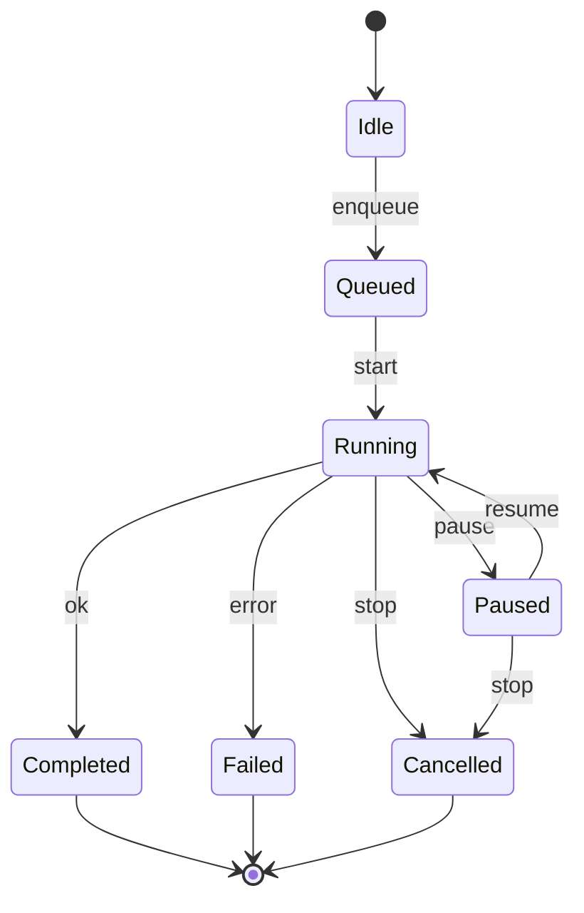
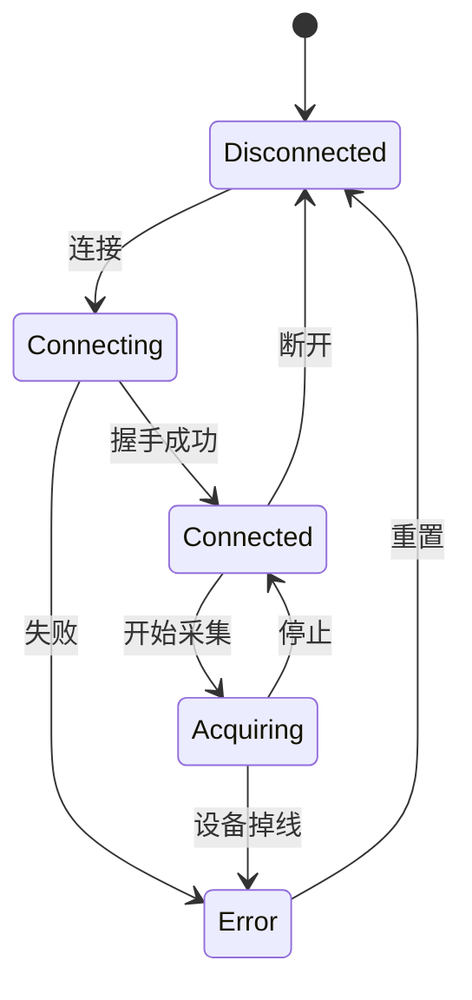
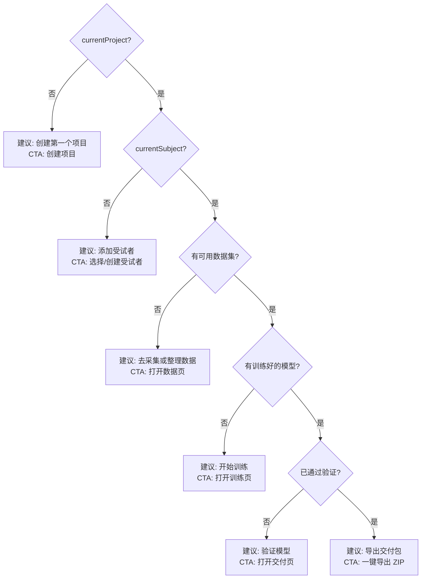
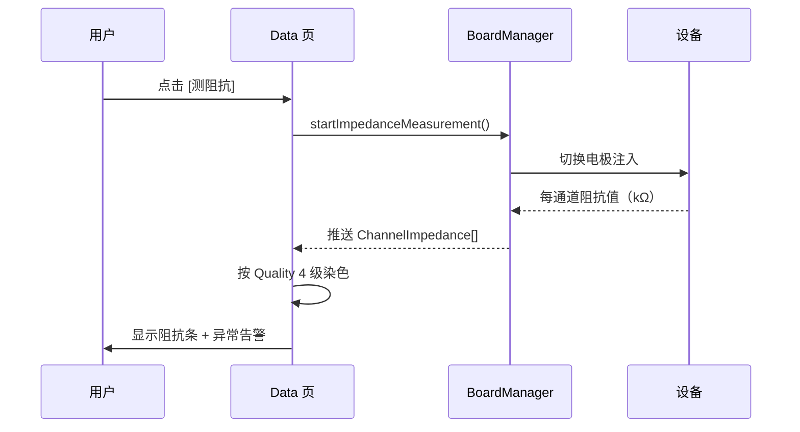
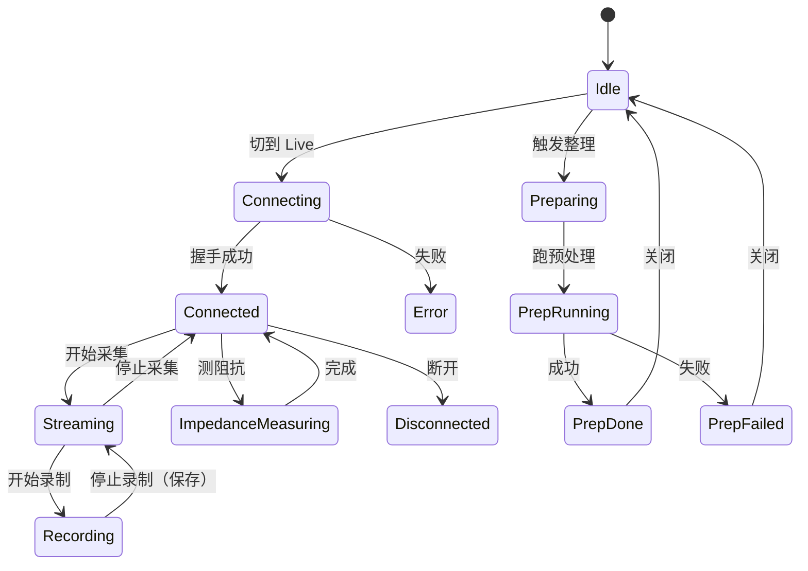
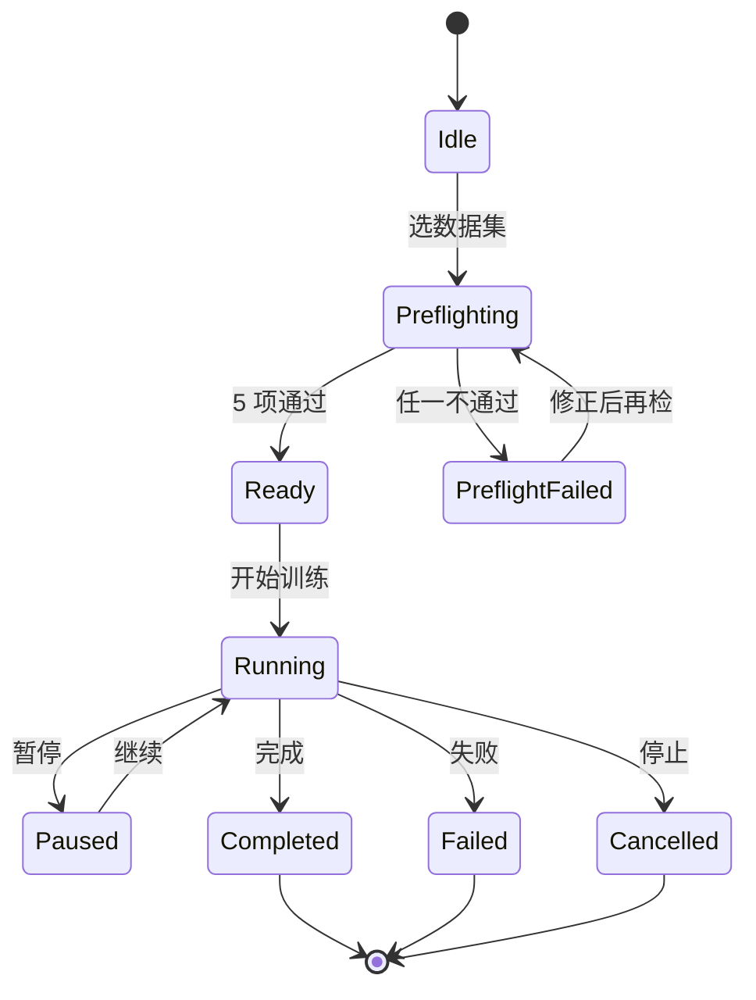
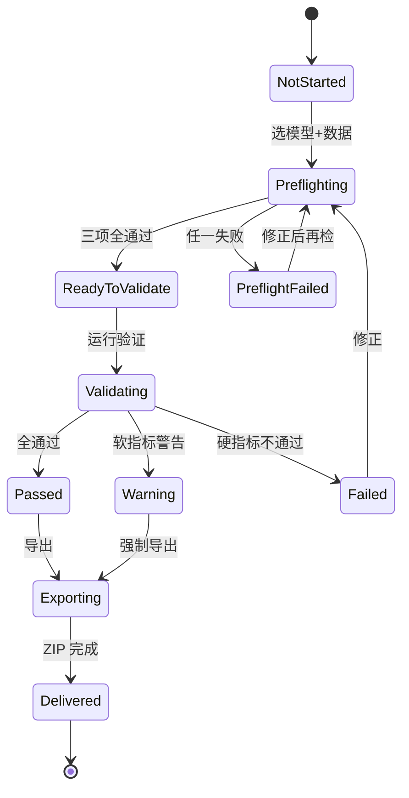

# NeuroRuntime 产品需求文档（PRD）

> 视角：产品经理（页面级 PRD）
> 配套：[PRODUCT_PLAN.md](PRODUCT_PLAN.md) / [DESIGN_SYSTEM.md](DESIGN_SYSTEM.md) / [GUI_SIMPLIFICATION_PROPOSAL.md](GUI_SIMPLIFICATION_PROPOSAL.md)
> 编码原则：编码前思考 / 简洁优先 / 实用优先 / 精准修改 / 目标驱动执行
> 一致性约束：所有字段名 / 实体名与 [Source/Domain/Entities.h](../Source/Domain/Entities.h) 完全一致

---

## 目录

- [1. 全局信息架构（IA）](#1-全局信息架构ia)
- [2. 全局状态模型](#2-全局状态模型)
- [3. 页面 PRD](#3-页面-prd)
  - [3.1 工作台 Home](#31-工作台-home)
  - [3.2 数据 Data](#32-数据-data)
  - [3.3 训练 Train](#33-训练-train)
  - [3.4 交付 Deliver](#34-交付-deliver)
- [4. 全局组件 PRD](#4-全局组件-prd)
- [5. 数据字典](#5-数据字典)
- [6. 错误码体系](#6-错误码体系)

---

## 1. 全局信息架构（IA）

### 1.1 4 页结构

| 编号 | 页面 | 快捷键 | 主要动词 | 主要产物 |
|------|------|--------|---------|---------|
| P1 | 工作台 Home | `Ctrl+0` | 看 / 决定下一步 | 无（决策中心）|
| P2 | 数据 Data | `Ctrl+1` | 采集 / 整理 | NPZ 数据集 |
| P3 | 训练 Train | `Ctrl+2` | 训练 / 监控 | ONNX 模型 |
| P4 | 交付 Deliver | `Ctrl+3` | 验证 / 导出 | 交付 ZIP（onnx + manifest + labels + report）|

### 1.2 顶级状态对象（贯穿 4 页）


每个对象对应 [Source/Domain/Entities.h](../Source/Domain/Entities.h) 的同名 struct。

### 1.3 全局壳层（AppShell）

```
┌────────────────────────────────────────────────────────────┐
│  StatusStrip (28px)  项目+受试者面包屑 │主操作 │次操作 │ ⋯  │
├──────┬─────────────────────────────────────────────────────┤
│ Nav  │                                                     │
│ Strip│              Page Content                           │
│ 96px │              (Home / Data / Train / Deliver)        │
│      │                                                     │
├──────┴─────────────────────────────────────────────────────┤
│  LogDrawer (28px collapsed / 200px expanded, Ctrl+L)       │
└────────────────────────────────────────────────────────────┘
```

---

## 2. 全局状态模型

### 2.1 任务态（与 [TaskState.h](../Source/Domain/TaskState.h) 完全对齐）



### 2.2 设备态（DeviceState.Status，与 [GlobalContextStore.h](../Source/Application/GlobalContextStore.h) 一致）



### 2.3 阻抗态（ChannelImpedance::Quality）

| 阈值 | 状态 | 颜色 | 文本 |
|------|------|------|------|
| `< 30 kΩ` | Good | `#07C160` 绿 | 良好 |
| `30–100 kΩ` | Acceptable | `#FA8C16` 橙 | 可接受 |
| `100–500 kΩ` | Poor | `#FF4D4F` 红 | 不良 |
| `> 500 kΩ` | Disconnected | `#BBBBBB` 灰 | 断开 |
| `< 0` | Unknown | `#999999` 暗灰 | 未测量 |

---

## 3. 页面 PRD

### 3.1 工作台 Home

#### 3.1.1 页面契约（5 问 5 答）

| 问 | 答 |
|----|----|
| 用户在哪？ | NavStrip 高亮"工作台" |
| 焦点对象？ | 当前 Project + 当前 Subject |
| 当前状态？ | 4 步进度条 + 下一步建议卡 |
| 安全动作？ | 切换项目 / 切换受试者 / 跳转下一步 |
| 输出产物？ | 无（导航中心）|

#### 3.1.2 主任务 / 二级任务

- **主任务**：1 句话回答"我现在该做什么？"
- **二级任务**：① 切换项目 ② 切换受试者 ③ 创建新项目 ④ 打开最近产物

#### 3.1.3 字段表

| 字段 | 类型 | 必填 | 来源 | 默认/示例 | 说明 |
|------|------|------|------|----------|------|
| `currentProjectName` | string | 是 | `GlobalContextStore.currentProject.name` | "ProjectA" | 顶部面包屑左 |
| `currentSubjectName` | string | 否 | `GlobalContextStore.currentSubject.getDisplayName()` | "S001" | 顶部面包屑右 |
| `nextActionTitle` | string | 是 | 决策树（见 §3.1.4）| "数据集还差 12 个 NPZ" | 主卡标题 |
| `nextActionCta` | string | 是 | 决策树 | "去整理 →" | 主卡按钮文案 |
| `nextActionTarget` | tab id | 是 | 决策树 | "data" | 点击跳转目标 |
| `step1Done` | bool | 是 | `dataset != null` | true | 进度 ① |
| `step2Done` | bool | 是 | `model != null` | false | 进度 ② |
| `step3Done` | bool | 是 | `validation.passed` | false | 进度 ③ |
| `step4Done` | bool | 是 | `delivery.exported` | false | 进度 ④ |
| `recentArtifacts` | list[5] | 否 | 项目目录扫描 | [Recording/Dataset/Model/Report] | 最近产物 |

#### 3.1.4 "下一步"决策树



#### 3.1.5 异常路径

| 场景 | UI 表现 | 行为 |
|------|---------|------|
| 无项目 | Home 显示欢迎卡 + 大按钮"创建第一个项目" | NavStrip 仅 Home 可点，其他禁用并 Tooltip |
| 项目目录被外部删除 | Snackbar 红色"项目路径丢失" + 自动切回上一项目 | 调用 `Context().removeProject(id)` |
| 多个挂起任务 | 进度卡显示"有 2 个任务未完成" + 链接 | 点击展开任务列表 |

#### 3.1.6 验收用例（Given / When / Then）

| ID | Given | When | Then |
|----|-------|------|------|
| AC-H1 | 首次启动，无任何项目 | 进入 Home | 显示欢迎卡 + 创建按钮，NavStrip 其他页禁用 |
| AC-H2 | 已选项目但无受试者 | 进入 Home | 下一步建议为"添加受试者"，CTA 跳数据页 |
| AC-H3 | 已有数据集，无模型 | 进入 Home | 下一步建议为"开始训练"，进度 ① 已完成 |
| AC-H4 | 已通过验证 | 进入 Home | 下一步建议为"导出交付包"，进度 ①②③ 全亮 |
| AC-H5 | 切换项目 | 顶部面包屑选另一项目 | 整页内容刷新 ≤ 200ms，最近产物列表更新 |

---

### 3.2 数据 Data

#### 3.2.1 页面契约

| 问 | 答 |
|----|----|
| 用户在哪？ | NavStrip 高亮"数据" |
| 焦点对象？ | 当前 Recording（采集中）或 当前 Dataset（整理中）|
| 当前状态？ | DeviceState.Status / TaskState |
| 安全动作？ | 切换来源 / 开始采集 / 停止采集 / 生成数据集 / 中止 |
| 输出产物？ | `Recording`（NPZ）或 `ProcessedDataset`（dataset_summary + data.npz）|

#### 3.2.2 来源切换矩阵

| 来源 | 主区域 | 必填字段 | 产物 |
|------|--------|---------|------|
| **真机 LiveBoard** | 实时波形 + 阻抗 | 设备类型 / 通道数 / 采样率 / 导联系统 | Recording |
| **回放 Playback** | 文件列表 + 选中文件预览波形 | NPZ 文件路径 | （仅查看，不产出新 Recording）|
| **合成 Synthetic** | 实时波形（模拟生成）| 通道数 / 采样率 / 信号模式 | Recording（合成）|

切换来源 = 重置主区域内容；不丢失左侧"整理"参数。

#### 3.2.3 字段表（30 项）

##### 3.2.3.1 来源与设备（左侧顶部 6 项）

| 字段 | 类型 | 必填 | 选项 / 范围 | 默认 | 说明 |
|------|------|------|-----------|------|------|
| `dataSource` | enum | 是 | `LiveBoard` / `Playback` / `Synthetic` | `Synthetic` | 见 §3.2.2 |
| `playbackPath` | path | 条件 | 任意 NPZ 目录或文件 | "" | 仅 Playback 必填 |
| `liveConnectionInfo` | string | 条件 | "192.168.1.10:8080" 或串口号 | "" | 仅 LiveBoard |
| `deviceType` | string | 否 | "Cyton" / "Synthetic" / ... | 自动检测 | 由 BoardManager 填 |
| `subjectId` | id | 是 | 当前项目下注册的 Subject | — | 不可为空 |
| `sessionNotes` | string | 否 | ≤ 200 字 | "" | 备注 |

##### 3.2.3.2 采集参数（左侧中部 4 项）

| 字段 | 类型 | 必填 | 选项 | 默认 | 说明 |
|------|------|------|------|------|------|
| `channelCount` | enum | 是 | `8 / 16 / 32 / 64` | 16 | README 第 25 行 |
| `sampleRate` | enum | 是 | `250 / 500 / 1000 / 2000` Hz | 500 | README 第 27 行 |
| `montageType` | enum | 是 | `10-20 / 10-10 / 10-5` | `10-20` | README 第 26 行 |
| `recordFilterMode` | enum | 否 | `none` / `bandpass_1_45` | `none` | 录制滤波（写入 NPZ）|

##### 3.2.3.3 显示参数（左侧底部 5 项，不影响录制）

| 字段 | 类型 | 必填 | 选项 | 默认 | 说明 |
|------|------|------|------|------|------|
| `displayUvRange` | enum | 是 | `±50µV / ±100µV / ±1mV / ±10mV / ±100mV` | `±100µV` | README 第 28 行 |
| `displayFilter` | enum | 是 | `原始 / 1-45Hz / 5-35Hz / 8-25Hz / 去平均` | `1-45Hz` | README 第 29 行 |
| `displayTimeWindow` | enum | 否 | `5 / 10 / 15 / 30` 秒 | `10` | 横轴长度 |
| `autoRange` | bool | 否 | true / false | false | 自动量程 |
| `visibleChannels` | bitset | 否 | 任意通道子集 | 全部 | 通道列表勾选 |

##### 3.2.3.4 录制参数（左侧 3 项）

| 字段 | 类型 | 必填 | 选项 | 默认 | 说明 |
|------|------|------|------|------|------|
| `recordDuration` | int (sec) | 否 | `30 / 60 / 120 / 300 / 600 / custom` | 60 | 录制目标时长 |
| `autoSave` | bool | 否 | true / false | true | 到时自动保存 |
| `recordingNamePattern` | string | 否 | "`{subject}_{date}_{seq}`" | 同左 | 文件命名 |

##### 3.2.3.5 整理 / 预处理（左侧底部 12 项）

| 字段 | 类型 | 必填 | 选项 | 默认 | 说明 |
|------|------|------|------|------|------|
| `prepInputDir` | path | 是 | 任意目录或选中的 Recording | 自动 | 输入 NPZ 目录 |
| `prepOutputDir` | path | 是 | 项目下 datasets/ 子目录 | 自动 | 产出位置 |
| `enableResample` | bool | 是 | — | true | 启用重采样 |
| `targetRate` | enum | 条件 | `128 / 250 / 500 / 1000` | 250 | 目标采样率 |
| `enableBandpass` | bool | 是 | — | true | 启用带通 |
| `lowFreq` | float | 条件 | 0.1–100 | 1.0 | 低截止 Hz |
| `highFreq` | float | 条件 | 1–200 | 45.0 | 高截止 Hz |
| `enableNotch` | bool | 是 | — | true | 启用陷波 |
| `notchFreq` | enum | 条件 | `50Hz / 60Hz / 50+60Hz` | `50Hz` | 工频陷波 |
| `enableEpoch` | bool | 是 | — | true | 启用分段 |
| `epochLengthSec` | float | 条件 | 0.5–10 | 4.0 | 分段长度 |
| `epochOverlapPct` | int | 条件 | 0–90 | 50 | 重叠百分比 |

> **高级折叠区**（默认隐藏）：`enableArtifactRemoval` / `artifactMethod` (`ICA / ASR / Template`) / `enableReReference` / `rerefType` / `augTimeWarp` / `augChannelDrop` / `augAmplScale` / `augGaussNoise` / `augCopies`

#### 3.2.4 阻抗测量子流程



异常处理：
- 任意通道 `> 100 kΩ` 即弹 Snackbar Warning，但**不阻断录制**（采集工程师有权选择继续）
- 全部通道 `< 30 kΩ` 时主操作按钮文案变为绿色"开始录制（阻抗良好）"

#### 3.2.5 状态机



#### 3.2.6 异常路径

| 场景 | UI 表现 | 错误码 | 用户动作 |
|------|---------|-------|---------|
| 设备未连接 | 主区域空状态 + "连接设备"按钮 | ACQ-001 | 点击连接 |
| 设备掉线（采集中）| 红色 Snackbar + 状态栏变红 + 自动停止录制 | ACQ-002 | 重连 / 查看日志 |
| 阻抗超阈（≥1 通道 > 500kΩ）| 通道行变灰 + 警告 Chip | ACQ-003 | 重贴电极 / 强行继续 |
| NPZ 路径无效（Playback）| 文件列表空 + 提示路径 | DATA-001 | 重新选择 |
| NPZ 损坏 | 单文件标红 + 错误信息 | DATA-002 | 排除该文件 |
| 整理失败：磁盘满 | 红色对话框 + "查看磁盘 / 修改输出路径" | DATA-003 | 释放空间 |
| 整理失败：参数无效（low ≥ high）| 实时校验，禁用 [生成数据集] | DATA-004 | 修正参数 |
| 整理失败：通道数不一致 | 异常列表标记每个文件 | DATA-005 | 排除或重采集 |

#### 3.2.7 验收用例

| ID | Given | When | Then |
|----|-------|------|------|
| AC-D1 | 已选项目无受试者 | 切到 Data | 顶部出现"先选择受试者"提示，主操作禁用 |
| AC-D2 | 来源 = Synthetic，参数 16ch/500Hz | 点击 [开始采集] | 3 秒内出现波形，状态变 Streaming |
| AC-D3 | Live 模式下设备拔线 | 拔 USB | ≤ 3 秒红色 Snackbar + 自动停止录制；NPZ 已保存截断段 |
| AC-D4 | Streaming 中按 Ctrl+M | 按下 | 波形上出现 marker 红线 + 时间戳；最近 marker Chip 行 +1 |
| AC-D5 | Playback 选 5 个 NPZ + 默认整理 | 点击 [生成数据集] | 进度条到 100%，dataset_summary.json 含 5 条记录 |
| AC-D6 | 整理参数 low=10 high=5 | 编辑 highFreq | [生成数据集] 按钮禁用 + 输入框红色边框 + Tooltip "低截止必须小于高截止" |
| AC-D7 | 整理失败 1 个文件 | 完成后 | 异常文件列表显示 1 项，dataset_summary.json `failedFiles` 包含该文件 |
| AC-D8 | 切换 displayUvRange | 选 ±1mV | 波形量程立即变化，但 NPZ 数据不变 |

---

### 3.3 训练 Train

#### 3.3.1 页面契约

| 问 | 答 |
|----|----|
| 用户在哪？ | NavStrip 高亮"训练" |
| 焦点对象？ | 当前 TrainingJob |
| 当前状态？ | TaskState |
| 安全动作？ | Preflight / Start / Pause / Stop / 看曲线 |
| 输出产物？ | `ModelArtifact`（onnx + manifest + labels）|

#### 3.3.2 字段表（核心 6 项 + 高级 4 项）

##### 核心字段（默认显示）

| 字段 | 类型 | 必填 | 选项 / 范围 | 默认 | Entities.h 字段 |
|------|------|------|-----------|------|----------------|
| `datasetId` | id | 是 | 当前项目下的 Dataset | 最近一个 | TrainingJob.datasetId |
| `modelTemplate` | enum | 是 | `EEGNet / EEG-Conformer / LaBraM / BIOT` | `EEGNet` | TrainingJob.modelTemplate |
| `epochs` | int | 是 | 10 – 500 | 100 | TrainingJob.epochs |
| `batchSize` | enum | 是 | `16 / 32 / 64 / 128` | 32 | TrainingJob.batchSize |
| `learningRate` | float | 是 | 1e-5 – 1e-1（对数滑块）| 1e-3 | TrainingJob.learningRate |
| `outputModelName` | string | 是 | 合法文件名 | "model_v{自增}" | ModelArtifact.modelName |

##### 高级字段（折叠，默认隐藏）

| 字段 | 类型 | 必填 | 默认 | 说明 |
|------|------|------|------|------|
| `trainingParadigm` | enum | 否 | `supervised` | TrainingJob.trainingParadigm |
| `pretrainedModelId` | id | 条件 | "" | finetune 时必填 |
| `freezeLayers` | int | 否 | 0 | 冻结前 N 层 |
| `randomSeed` | int | 否 | 42 | 复现性 |

#### 3.3.3 训练前 Preflight 5 项检查（与 [TrainPreflight.h](../Source/Core/TrainPreflight.h) 对齐）

| 编号 | 检查项 | 失败码 | 提示 |
|------|--------|-------|------|
| PF1 | 数据目录存在 | `BadDir` | "数据目录不存在或无访问权限" |
| PF2 | 目录内有 NPZ | `NoNpz` | "目录内未找到 *.npz 文件" |
| PF3 | NPZ 可读 | `NpzReadErr` | 显示首个错误文件 |
| PF4 | 形状一致（C × T 占多数）| `ManifestMismatch` | "目录混合多种形状，建议先整理" |
| PF5 | manifest.json 形状对齐（如有）| `ManifestMismatch` | "manifest C×T 与数据不一致" |

`Preflight Strip` 显示 5 个状态点 + 一行总结：

```
PF1 ● 通过   PF2 ● 通过   PF3 ● 通过   PF4 ● 通过   PF5 ○ 跳过
─────────────────────────────────────────────────────
✅ 5/5 项通过 · NPZ 共 240 个 · 形状 16×500 · 类别 4 · [开始训练]
```

#### 3.3.4 状态机



#### 3.3.5 异常路径

| 场景 | UI 表现 | 错误码 | 用户动作 |
|------|---------|-------|---------|
| Preflight 任一不通过 | Strip 状态点变红 + Start 禁用 | TRAIN-001 | 看错误文本修正 |
| 训练中 Python 进程崩溃 | 红色对话框 + 错误码 + 复制堆栈 | TRAIN-002 | 重试 / 查看日志 |
| OOM（GPU 显存不足）| 自动建议降 batch_size | TRAIN-003 | 一键应用建议 |
| 形状不匹配（中途）| 立即停止 + 错误对话框 | TRAIN-004 | 检查数据集 |
| 磁盘满（保存中）| 暂停训练 + 提示 | TRAIN-005 | 释放空间后续训 |
| 训练耗时异常长（>5h 单 epoch）| 黄色 Snackbar 提示 | TRAIN-006 | 用户决定 |

#### 3.3.6 验收用例

| ID | Given | When | Then |
|----|-------|------|------|
| AC-T1 | 选未整理目录（混形状）| 跑 Preflight | PF4 红 + 提示"先整理" |
| AC-T2 | 选合法数据集 | 跑 Preflight | 5 项绿 + Start 可点击；总耗时 ≤ 3 秒 |
| AC-T3 | 开始训练 | Running 中 | 双曲线每 epoch 更新 1 次；4 数字（loss/acc/epoch/ETA）≥ 1Hz 刷新 |
| AC-T4 | 按 Space | Running 中 | 切换 Pause；图表暂停采点；按钮变[Resume] |
| AC-T5 | 训练完成 | Completed | ONNX 自动注册到 ModelRegistry；Snackbar"模型已就绪 → 去验证"; 跳交付页可用 |
| AC-T6 | 中途 Python 崩溃 | 任一 epoch | 错误对话框含 TRAIN-002 + 复制堆栈 + 打开日志按钮 |

---

### 3.4 交付 Deliver

#### 3.4.1 页面契约

| 问 | 答 |
|----|----|
| 用户在哪？ | NavStrip 高亮"交付" |
| 焦点对象？ | 当前 ModelArtifact + 当前 ValidationResult |
| 当前状态？ | ValidationResult.passed + riskLevel |
| 安全动作？ | Run Validation / Export ZIP / Compare baseline |
| 输出产物？ | `ValidationResult` + 交付 ZIP |

#### 3.4.2 Preflight Strip 三态

| 检查项 | 通过 | 警告 | 失败 |
|--------|------|------|------|
| 模型形状（C × T × n_classes）| onnx 输入维度齐全 | manifest 缺字段 | onnx 加载失败 |
| 测试数据 | NPZ 形状与模型对齐 | 无 ground_truth（仅推理）| 形状不匹配 |
| 对齐检查 | 通道映射 + 采样率 + 归一化方式一致 | 任一项标记"未确认" | 任一项不一致 |

任一失败 → 主操作 [运行验证] 禁用。

#### 3.4.3 验证结论 4 态（与 [ValidationPage.h](../Source/UI/Pages/ValidationPage.h) 一致）

| 状态 | 触发条件 | 颜色 | 主操作 |
|------|---------|------|--------|
| `NotStarted` | 尚未运行 | 灰 | [运行验证] |
| `Passed` | accuracy ≥ 阈值 + Golden 全过 + 漂移 < 1e-3 | 绿 | [导出交付包] |
| `Warning` | 指标合格但 Golden ≥1 失败 或 漂移 1e-3 ~ 1e-2 | 橙 | [仍要导出] / [查看详情] |
| `Failed` | 任一硬指标不通过 | 红 | [查看失败详情] |

#### 3.4.4 字段表

| 字段 | 类型 | 必填 | 默认 | 说明 |
|------|------|------|------|------|
| `modelPath` | path | 是 | 最近一次训练产物 | onnx 路径 |
| `manifestPath` | path | 自动 | 同目录 manifest.json | 元数据 |
| `labelsPath` | path | 自动 | 同目录 labels.json | 类别 |
| `testDataPath` | path | 是 | 训练用 dataset 的 holdout 子集 | 验证数据 |
| `goldenSamplePath` | path | 否 | 项目 golden/ 目录 | Golden Sample |
| `accuracyThreshold` | float | 否 | 0.7 | 通过线 |
| `compareBaselineId` | id | 否 | "" | 对比 baseline 模型 |
| `exportZipName` | string | 否 | "{modelName}_v{x}_delivery.zip" | 导出文件名 |

#### 3.4.5 导出包结构

```
{modelName}_v{x}_delivery.zip
├── model.onnx
├── manifest.json              # 含 inputC / inputT / outputClasses
├── labels.json                # 类别中英文名
├── golden_sample.npz          # 可选，含 framework + onnx 推理结果对比
├── dataset_summary.json       # 训练数据集元信息
├── validation_result.json     # 本次验证结论 + 指标
├── report.pdf                 # 一页结论报告（V3 实现）
├── version_info.txt           # NeuroRuntime 版本 + 训练时间 + 主机指纹
└── README.txt                 # 客户端加载说明
```

#### 3.4.6 状态机



#### 3.4.7 异常路径

| 场景 | UI 表现 | 错误码 | 用户动作 |
|------|---------|-------|---------|
| ONNX 加载失败 | 结论卡红色 | DELIVER-001 | 检查模型 |
| 形状不一致 | Preflight Strip 失败点 | DELIVER-002 | 重新整理或重训 |
| Golden Sample 失败 | 结论 Warning + 失败列表 | DELIVER-003 | 强制导出 / 重训 |
| 推理超时 (>30s/sample) | 黄色 Snackbar | DELIVER-004 | 检查硬件加速 |
| 导出失败：ZIP 路径无写权限 | 错误对话框 | DELIVER-005 | 修改路径 |
| Baseline 模型缺失 | 对比按钮禁用 + Tooltip | DELIVER-006 | 选其他 baseline |

#### 3.4.8 验收用例

| ID | Given | When | Then |
|----|-------|------|------|
| AC-V1 | 训练完成跳来 | 进入 Deliver | modelPath / manifest / labels 自动填充；Preflight 自动跑 |
| AC-V2 | Preflight 全过 | 点 [运行验证] | 进度条 + 各指标卡每秒刷新 |
| AC-V3 | 验证通过 | Passed | 结论卡绿色 + acc/F1 显示 + [导出交付包] 主按钮 |
| AC-V4 | 点 [导出交付包] | 完成后 | ZIP 包含 §3.4.5 全部 9 个文件 + 自动打开所在目录 |
| AC-V5 | 选 baseline 对比 | Compare 按钮 | 显示 acc / per-class diff 表 |

---

## 4. 全局组件 PRD

### 4.1 命令面板（CommandPalette，Ctrl+K）

| 维度 | 规范 |
|------|------|
| 触发 | `Ctrl+K`（任意页面）|
| 关闭 | `Esc` 或外部点击 |
| 命令数 | ≤ 20 条（避免堆砌）|
| 搜索 | 模糊匹配 label + 中英别名 |
| 分组 | 导航 / 项目 / 任务 / 系统 4 组 |
| 键盘 | ↑↓ 切换、Enter 执行 |

#### 命令注册表（V1，共 18 条）

| 分组 | 命令 | 别名 | 动作 |
|------|------|------|------|
| 导航 | 打开工作台 | home / overview | switchTab(Home) |
| 导航 | 打开数据 | data / 采集 / 整理 | switchTab(Data) |
| 导航 | 打开训练 | train / 训练 | switchTab(Train) |
| 导航 | 打开交付 | deliver / 验证 / 导出 | switchTab(Deliver) |
| 项目 | 创建项目 | new project | showCreateProjectDialog |
| 项目 | 切换项目 | switch project | showProjectQuickSwitchMenu |
| 项目 | 创建受试者 | new subject | showCreateSubjectDialog |
| 项目 | 切换受试者 | switch subject | showSubjectQuickSwitchMenu |
| 任务 | 开始采集 | start acquisition | dataPage.startAcquisition |
| 任务 | 加 marker | add marker | dataPage.addEventMarker |
| 任务 | 测阻抗 | impedance | dataPage.measureImpedance |
| 任务 | 生成数据集 | run prep | dataPage.startPreprocessing |
| 任务 | 开始训练 | start training | trainPage.startTraining |
| 任务 | 运行验证 | run validation | deliverPage.runValidation |
| 任务 | 导出交付包 | export | deliverPage.exportPackage |
| 系统 | 设置 | settings | showSettingsDialog |
| 系统 | 系统日志 | log | showSystemLogPanel |
| 系统 | 关于 | about | showAboutDialog |

### 4.2 日志抽屉（LogDrawer，Ctrl+L）

| 维度 | 规范 |
|------|------|
| 折叠高度 | 28px（仅 toggle 把手 + 最近 1 条）|
| 展开高度 | 200px |
| 分级 | DEBUG / INFO / WARN / ERROR（默认 INFO 起）|
| 分类 | 采集 / 预处理 / 训练 / 推理 / 界面 / 通知 / App / System |
| 过滤 | 级别下限 + 分类多选 + 正文关键字 |
| 自动滚动 | 默认开 |
| 暂停 | 按钮临时停止滚动（不暂停日志记录）|
| 持久化 | `<AppRoot>/logs/nerou_YYYYMMDD.log`（已实现）|
| 导出 | 一键导出当前缓冲为 .log |
| 联动 | WARN/ERROR 自动冒泡为 Snackbar |

### 4.3 Snackbar（4 类型 × 3 时长）

| 类型 | 颜色 | 用途 | 默认时长 |
|------|------|------|---------|
| `Info` | 主色蓝 | 一般通知 | Short (3s) |
| `Success` | 绿 | 完成确认 | Short (3s) |
| `Warning` | 橙 | 需注意但不阻断 | Long (6s) |
| `Error` | 红 | 错误（同步打开日志）| Indefinite（必须用户关闭）|

时长档：`Short = 3s` / `Long = 6s` / `Indefinite = 用户关闭`

每条 Snackbar 至少含：图标 + 标题（≤ 12 字）+ 操作按钮（"查看 / 撤销 / 重试"，可选）。

### 4.4 设置对话框（Ctrl+,，5 个分组）

| 分组 | 设置项 |
|------|-------|
| 外观 | 主题（浅/深）/ 主色方案 / 密度（紧凑/舒适/宽敞）/ UI 字体大小 |
| 路径 | 默认项目根目录 / Python 解释器路径 / ONNX 模型库目录 / 日志目录 |
| 性能与加速 | 推理 EP（自动 / DirectML / CUDA / CPU）/ 训练线程数 / 波形渲染 FPS |
| 设备 | 默认通道数 / 默认采样率 / 默认导联系统 / BrainFlow Board ID |
| 关于 | 版本号 / 构建时间 / JUCE 版本 / 检查更新 / 打开日志目录 |

---

## 5. 数据字典

> **完全对齐**：所有字段名与 [Source/Domain/Entities.h](../Source/Domain/Entities.h) 一一对应。落盘位置见 README 第 132–146 行的项目目录结构。

### 5.1 Project（[Entities.h:13](../Source/Domain/Entities.h#L13)）

| 字段 | 类型 | 必填 | 默认 | 约束 | 落盘 |
|------|------|------|------|------|------|
| `id` | string | 是 | uuid | 全局唯一 | `projects/<id>/project.json` |
| `name` | string | 是 | "" | ≤ 64 字 | 同上 |
| `description` | string | 否 | "" | ≤ 500 字 | 同上 |
| `owner` | string | 否 | 当前用户名 | ≤ 32 字 | 同上 |
| `rootPath` | path | 是 | `projects/<id>/` | 必须存在 | 自身 |
| `createdAt` | Time | 是 | now | UTC | 同上 |
| `updatedAt` | Time | 是 | now | UTC | 同上 |
| `status` | enum | 否 | `active` | `active / archived` | 同上 |

### 5.2 Subject（[Entities.h:27](../Source/Domain/Entities.h#L27)）

| 字段 | 类型 | 必填 | 默认 | 约束 | 落盘 |
|------|------|------|------|------|------|
| `id` | string | 是 | uuid | 项目内唯一 | `projects/<x>/subjects.json` 数组项 |
| `name` | string | 否 | id | ≤ 64 字 | 同上 |
| `gender` | enum | 否 | "" | `male / female / other / ""` | 同上 |
| `age` | int | 否 | 0 | 0–150 | 同上 |
| `notes` | string | 否 | "" | ≤ 500 字 | 同上 |
| `projectId` | id | 是 | 当前项目 | FK Project.id | 同上 |
| `sessionCount` | int | 否 | 0 | ≥ 0，自动维护 | 同上 |

### 5.3 Session（[Entities.h:40](../Source/Domain/Entities.h#L40)）

| 字段 | 类型 | 必填 | 默认 | 约束 | 落盘 |
|------|------|------|------|------|------|
| `id` | string | 是 | uuid | 项目内唯一 | `projects/<x>/sessions/<id>/session.json` |
| `projectId` | id | 是 | — | FK | 同上 |
| `subjectId` | id | 是 | — | FK | 同上 |
| `deviceType` | string | 否 | "" | "Synthetic / Cyton / ..." | 同上 |
| `deviceSerial` | string | 否 | "" | — | 同上 |
| `channelCount` | int | 是 | 16 | `8 / 16 / 32 / 64` | 同上 |
| `sampleRate` | int | 是 | 500 | `250 / 500 / 1000 / 2000` | 同上 |
| `montageType` | enum | 否 | `10-20` | `10-20 / 10-10 / 10-5` | 同上 |
| `displayFilter` | enum | 否 | `1-45Hz` | 5 档（README 第 29 行）| 同上 |
| `recordFilterMode` | enum | 否 | `none` | `none / bandpass_1_45` | 同上 |
| `connectionInfo` | string | 否 | "" | — | 同上 |
| `startedAt` | Time | 否 | now | UTC | 同上 |
| `endedAt` | Time | 否 | — | UTC | 同上 |
| `durationSec` | double | 否 | 0 | ≥ 0 | 同上 |
| `status` | enum | 否 | `created` | `created / active / closed` | 同上 |
| `notes` | string | 否 | "" | ≤ 500 字 | 同上 |

### 5.4 Recording（[Entities.h:62](../Source/Domain/Entities.h#L62)）

| 字段 | 类型 | 必填 | 默认 | 约束 | 落盘 |
|------|------|------|------|------|------|
| `id` | string | 是 | uuid | 项目内唯一 | `projects/<x>/recordings/<id>/recording.json` |
| `sessionId` | id | 是 | — | FK | 同上 |
| `projectId` | id | 是 | — | FK | 同上 |
| `subjectId` | id | 是 | — | FK | 同上 |
| `filePath` | path | 是 | `data.npz` 同目录 | 必须存在 | 同上 |
| `fileFormat` | string | 否 | `npz` | 当前固定 | 同上 |
| `sampleRate` | int | 是 | 与 Session 同 | 必须一致 | 同上 |
| `channelCount` | int | 是 | 与 Session 同 | 必须一致 | 同上 |
| `channelNames` | StringArray | 否 | 自动生成 | 长度 == channelCount | 同上 |
| `durationSec` | double | 是 | 自动计算 | ≥ 0 | 同上 |
| `sampleCount` | int | 是 | 自动 | ≥ 0 | 同上 |
| `impedanceSummary` | var | 否 | {} | JSON | 同上 |
| `qualityScore` | double | 否 | 0 | 0–1 | 同上 |
| `eventCount` | int | 否 | 0 | ≥ 0 | 同上 |
| `createdAt` | Time | 是 | now | UTC | 同上 |
| `createdBy` | string | 否 | 当前用户 | — | 同上 |
| `status` | enum | 否 | `valid` | `valid / corrupt / partial` | 同上 |

### 5.5 ProcessedDataset（[Entities.h:85](../Source/Domain/Entities.h#L85)）

| 字段 | 类型 | 必填 | 默认 | 约束 | 落盘 |
|------|------|------|------|------|------|
| `id` | string | 是 | uuid | 项目内唯一 | `projects/<x>/datasets/<id>/dataset_summary.json` |
| `projectId` | id | 是 | — | FK | 同上 |
| `sourceRecordingIds` | StringArray | 是 | [] | ≥ 1 | 同上 |
| `inputPath` | path | 是 | — | 必须存在 | 同上 |
| `outputPath` | path | 是 | — | 必须存在 | 同上 |
| `sampleCount` | int | 是 | 0 | ≥ 0 | 同上 |
| `channelCount` | int | 是 | 与源一致 | 必须一致 | 同上 |
| `sampleRate` | int | 是 | 自动（重采样后）| 与 preprocessConfig 一致 | 同上 |
| `windowSize` | int | 是 | 自动 | epochLengthSec × sampleRate | 同上 |
| `labelCount` | int | 否 | 0 | ≥ 0 | 同上 |
| `preprocessConfig` | var | 是 | — | JSON 含全部参数 | 同上 |
| `summaryPath` | path | 是 | dataset_summary.json | 必须存在 | 同上 |
| `failedFiles` | StringArray | 否 | [] | — | 同上 |
| `createdAt` | Time | 是 | now | UTC | 同上 |
| `state` | TaskState | 是 | Idle | 7 态 | 同上 |

### 5.6 TrainingJob（[Entities.h:106](../Source/Domain/Entities.h#L106)）

| 字段 | 类型 | 必填 | 默认 | 约束 | 落盘 |
|------|------|------|------|------|------|
| `id` | string | 是 | uuid | 项目内唯一 | `projects/<x>/logs/<id>/job.json` |
| `projectId` | id | 是 | — | FK | 同上 |
| `datasetId` | id | 是 | — | FK | 同上 |
| `taskType` | string | 否 | `classification` | — | 同上 |
| `modelTemplate` | enum | 是 | `EEGNet` | 4 模板 | 同上 |
| `trainingParadigm` | enum | 否 | `supervised` | `supervised / finetune` | 同上 |
| `pretrainedModelId` | id | 条件 | "" | finetune 必填 | 同上 |
| `classCount` | int | 是 | 自动 | ≥ 2 | 同上 |
| `epochs` | int | 是 | 100 | 10–500 | 同上 |
| `batchSize` | int | 是 | 32 | `16 / 32 / 64 / 128` | 同上 |
| `learningRate` | double | 是 | 1e-3 | 1e-5 – 1e-1 | 同上 |
| `trainConfig` | var | 否 | {} | JSON 含全参 | 同上 |
| `preflightResult` | var | 是 | — | JSON | 同上 |
| `logPath` | path | 是 | log.txt | — | 同上 |
| `metricsPath` | path | 是 | metrics.json | — | 同上 |
| `startedAt` | Time | 否 | — | — | 同上 |
| `endedAt` | Time | 否 | — | — | 同上 |
| `state` | TaskState | 是 | Idle | 7 态 | 同上 |
| `resultModelId` | id | 否 | "" | FK ModelArtifact | 同上 |

### 5.7 ModelArtifact（[Entities.h:133](../Source/Domain/Entities.h#L133)）

| 字段 | 类型 | 必填 | 默认 | 约束 | 落盘 |
|------|------|------|------|------|------|
| `id` | string | 是 | uuid | 项目内唯一 | `projects/<x>/models/<id>/manifest.json` |
| `projectId` | id | 是 | — | FK | 同上 |
| `modelName` | string | 是 | "" | 合法文件名 | 同上 |
| `version` | string | 否 | `v1` | 自增 | 同上 |
| `taskType` | string | 否 | `classification` | — | 同上 |
| `onnxPath` | path | 是 | model.onnx | 必须存在 | 同上 |
| `manifestPath` | path | 是 | manifest.json | 必须存在 | 同上 |
| `labelsPath` | path | 是 | labels.json | 必须存在 | 同上 |
| `goldenSamplePath` | path | 否 | golden.npz | 可选 | 同上 |
| `inputChannels` | int | 是 | — | == 训练数据 C | 同上 |
| `inputSamples` | int | 是 | — | == 训练数据 T | 同上 |
| `inputSampleRate` | int | 是 | — | == 数据集 sampleRate | 同上 |
| `outputClasses` | int | 是 | — | == labels.json 长度 | 同上 |
| `classNames` | StringArray | 是 | — | 长度 == outputClasses | 同上 |
| `createdAt` | Time | 是 | now | UTC | 同上 |
| `createdFromJobId` | id | 是 | — | FK TrainingJob | 同上 |
| `validationStatus` | enum | 否 | `unknown` | `unknown / passed / warning / failed` | 同上 |
| `isRecommended` | bool | 否 | false | 当前最优为 true | 同上 |

### 5.8 ValidationResult（[Entities.h:157](../Source/Domain/Entities.h#L157)）

| 字段 | 类型 | 必填 | 默认 | 约束 | 落盘 |
|------|------|------|------|------|------|
| `id` | string | 是 | uuid | 项目内唯一 | `projects/<x>/validations/<id>/validation_result.json` |
| `projectId` | id | 是 | — | FK | 同上 |
| `modelId` | id | 是 | — | FK ModelArtifact | 同上 |
| `datasetId` | id | 否 | — | FK | 同上 |
| `inferenceJobId` | id | 否 | — | FK | 同上 |
| `validationType` | enum | 是 | `offline` | `offline / golden_sample / regression` | 同上 |
| `passed` | bool | 是 | false | — | 同上 |
| `conclusion` | string | 是 | "" | ≤ 200 字 | 同上 |
| `riskLevel` | enum | 否 | `medium` | `low / medium / high` | 同上 |
| `metrics` | var | 是 | {} | JSON 含 acc/F1/per-class | 同上 |
| `issues` | StringArray | 否 | [] | — | 同上 |
| `suggestions` | StringArray | 否 | [] | — | 同上 |
| `reportPath` | path | 否 | report.pdf | 可选 | 同上 |
| `validatedAt` | Time | 是 | now | UTC | 同上 |
| `validatedBy` | string | 否 | 当前用户 | — | 同上 |

### 5.9 InferenceJob（[Entities.h:182](../Source/Domain/Entities.h#L182)）

> 用于：离线批量推理 / Golden Sample 回归 / 实时推理。

参见源码字段定义；不在本文档冗余展开。

---

## 6. 错误码体系

### 6.1 命名规范

```
{模块前缀}-{3 位数字}
```

模块前缀枚举：

| 前缀 | 模块 |
|------|------|
| `ACQ` | 采集 / 设备 |
| `DATA` | 数据整理 / NPZ |
| `TRAIN` | 训练 / Python |
| `DELIVER` | 验证 / 导出 |
| `SYS` | 系统 / 文件 / 配置 |
| `UI` | 界面渲染 |

### 6.2 V1 错误码表（共 25 条）

| 错误码 | 等级 | 中文摘要 | 建议动作 |
|--------|------|---------|---------|
| ACQ-001 | Warning | 设备未连接 | 选择设备并连接 |
| ACQ-002 | Error | 设备掉线 | 检查 USB / 网络后重连 |
| ACQ-003 | Warning | 阻抗超阈 | 重贴电极或选择继续 |
| ACQ-004 | Error | 不支持的通道数 | 改用 8/16/32/64 |
| ACQ-005 | Error | 不支持的采样率 | 改用 250/500/1000/2000Hz |
| DATA-001 | Warning | NPZ 路径无效 | 重新选择目录 |
| DATA-002 | Error | NPZ 文件损坏 | 排除该文件 |
| DATA-003 | Error | 磁盘空间不足 | 释放空间或换路径 |
| DATA-004 | Warning | 滤波参数无效（low ≥ high）| 修正频率范围 |
| DATA-005 | Error | 通道数不一致 | 排除或重采集 |
| DATA-006 | Warning | 整理失败但部分成功 | 看异常列表 |
| TRAIN-001 | Error | Preflight 不通过 | 修正后重试 |
| TRAIN-002 | Error | Python 进程崩溃 | 看日志 + 复制堆栈 |
| TRAIN-003 | Warning | GPU 显存不足 | 降 batch_size |
| TRAIN-004 | Error | 训练中形状不匹配 | 检查数据集 |
| TRAIN-005 | Error | 保存模型失败（磁盘）| 释放空间 |
| TRAIN-006 | Warning | 单 epoch 耗时异常 | 检查数据 / 硬件 |
| TRAIN-007 | Error | Python 环境不可用 | 检查解释器路径 |
| DELIVER-001 | Error | ONNX 加载失败 | 重新导出 |
| DELIVER-002 | Error | 形状不一致 | 重新整理或重训 |
| DELIVER-003 | Warning | Golden Sample 失败 | 强制导出或重训 |
| DELIVER-004 | Warning | 推理超时 | 启用硬件加速 |
| DELIVER-005 | Error | 导出 ZIP 失败 | 检查写权限 |
| DELIVER-006 | Info | Baseline 模型缺失 | 选其他 baseline |
| SYS-001 | Error | 配置文件读取失败 | 重置为默认 |

### 6.3 错误展示规范

每条错误必须以**结构化对象**显示（详见 [DESIGN_SYSTEM.md](DESIGN_SYSTEM.md) §7 错误诊断模式）：

```
┌─────────────────────────────────────────────┐
│ [图标]  错误标题（≤ 12 字）                 │
│        TRAIN-002                            │
│                                             │
│ 原因：Python 训练进程意外退出               │
│                                             │
│ 建议：                                      │
│ • 检查数据集大小（OOM 风险）                │
│ • 查看训练日志                              │
│                                             │
│ [复制错误码] [打开日志] [重试]              │
└─────────────────────────────────────────────┘
```

---

> 本文档为页面级 PRD，所有字段、状态机、错误码、数据字典与现有源码 1:1 对齐。视觉规范见 [DESIGN_SYSTEM.md](DESIGN_SYSTEM.md)；战略层规划见 [PRODUCT_PLAN.md](PRODUCT_PLAN.md)；重构动作见 [GUI_SIMPLIFICATION_PROPOSAL.md](GUI_SIMPLIFICATION_PROPOSAL.md)。
